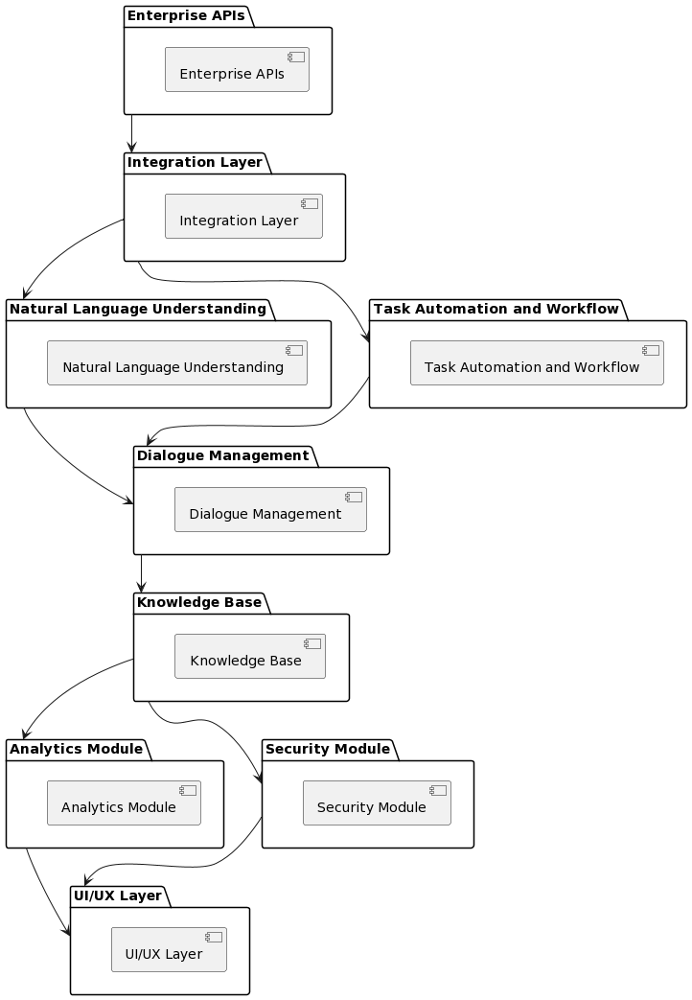

<banner class="page-header" role="banner">
  
</banner>

# Building Enterprise GenAI Chatbots

Previously we talked about [general issues related to  building an enterprise GenAI Chatbot](#EnterpriseBot). In this article we will proceed to flesh out specific issues that must be addressed, in order for such a chatbot to serve as a kind of customizable enterprise worker.

## Specific Goals

<!-- In order to build a kind of GenAI chatbot that can serve as a customizable worker that easily fits into the workflow of any enterprise, list the various design goals that must be achieved. Claude-3: -->

To build a GenAI chatbot that can serve as a customizable worker and easily integrate into the workflow of any enterprise, several key design goals must be achieved:

- Ensemble architecture
-    Flexibility and Customization:
        The chatbot should be highly customizable to adapt to the specific needs and requirements of different enterprises.
        It should allow easy configuration of the chatbot's knowledge base, conversational flow, and task-specific capabilities.
        The chatbot should support integration with various enterprise systems, databases, and APIs to access relevant information and perform tasks seamlessly.
-    Natural Language Understanding (NLU):
        The chatbot should have advanced NLU capabilities to accurately understand and interpret user queries, intents, and context.
        It should handle variations in language, terminology, and domain-specific jargon used within the enterprise.
        The NLU component should be trainable and adaptable to improve its understanding over time.
-    Conversational Intelligence:
        The chatbot should engage in natural, human-like conversations with users.
        It should maintain context, handle multi-turn dialogues, and provide relevant and coherent responses.
        The chatbot should be able to handle interruptions, clarifications, and topic switches gracefully.
-    Task Automation and Workflow Integration:
        The chatbot should be capable of automating repetitive tasks and workflows within the enterprise.
        It should integrate with existing enterprise systems, such as CRM, ERP, HR, and project management tools, to streamline processes and enhance productivity.
        The chatbot should have the ability to trigger actions, retrieve information, and update records based on user interactions.
-    Security and Privacy:
        The chatbot should adhere to strict security and privacy standards to protect sensitive enterprise data.
        It should incorporate authentication and authorization mechanisms to ensure only authorized users can access specific information and perform actions.
        The chatbot should comply with relevant data protection regulations and industry-specific compliance requirements.
-    Scalability and Performance:
        The chatbot should be designed to handle a high volume of concurrent users and requests.
        It should be scalable to accommodate the growing needs of the enterprise without compromising performance.
        The chatbot should have efficient resource utilization and fast response times to provide a seamless user experience.
-    Monitoring and Analytics:
        The chatbot should have built-in monitoring and analytics capabilities to track usage, performance, and user satisfaction.
        It should provide insights into user interactions, frequently asked questions, and areas for improvement.
        The analytics data should be used to continuously refine and optimize the chatbot's performance and effectiveness.
-    User-Friendly Interface:
        The chatbot should have an intuitive and user-friendly interface that aligns with the enterprise's branding and design guidelines.
        It should support multiple channels, such as web, mobile, and messaging platforms, to enable easy access for users.
        The interface should provide clear instructions, error handling, and fallback mechanisms to ensure a smooth user experience.
-    Continuous Learning and Improvement:
        The chatbot should have the ability to learn and improve over time based on user interactions and feedback.
        It should incorporate machine learning techniques to enhance its understanding, accuracy, and efficiency.
        The chatbot should be regularly updated with new knowledge, features, and capabilities to stay relevant and valuable to the enterprise.

By focusing on these design goals, you can create a GenAI chatbot that is flexible, intelligent, secure, and seamlessly integrates into the workflow of any enterprise, ultimately enhancing productivity and user satisfaction.

## Functionalities embodied in most enterprise workers' duties

<!-- make a list of the basic functionalities that encompass most of enterprise workers' duties, this is so that we are able to implement these functionalities using GenAI and other technologies. -->

Here's a list of basic functionalities that encompass most of enterprise workers' duties:

-    Communication and Collaboration:
        Email management
        Instant messaging and chat
        Video conferencing
        Document sharing and collaboration
        Task and project management
-    Information Management:
        Document creation, editing, and formatting
        File storage and organization
        Content management systems (CMS)
        Knowledge base and wiki management
        Search and retrieval of information
-    Data Entry and Processing:
        Form filling and data input
        Data validation and cleansing
        Data extraction and transformation
        Data analysis and reporting
        Spreadsheet management
-    Scheduling and Calendar Management:
        Appointment scheduling and reminders
        Meeting coordination and planning
        Resource allocation and booking
        Time tracking and timesheet management
-    Customer Service and Support:
        Helpdesk and ticketing systems
        Customer inquiries and issue resolution
        Product and service information provision
        Order processing and tracking
        Feedback and survey management
-    Human Resources and Employee Management:
        Employee onboarding and offboarding
        Performance tracking and evaluation
        Leave and absence management
        Benefits administration
        Training and development
-    Financial and Accounting Tasks:
        Invoice processing and payment tracking
        Expense reporting and reimbursement
        Budget management and forecasting
        Financial data entry and reconciliation
        Tax compliance and reporting
-    Sales and Marketing Support:
        Lead generation and management
        Customer relationship management (CRM)
        Marketing campaign management
        Sales forecasting and reporting
        Product catalog and pricing management
-    IT and Technical Support:
        Troubleshooting and problem resolution
        Software installation and configuration
        User account management and access control
        Network and system monitoring
        Cybersecurity and data protection
-    Workflow Automation:
        Process mapping and optimization
        Automated task assignment and routing
        Notification and alert systems
        Integration with enterprise systems (ERP, CRM, etc.)
        Robotic Process Automation (RPA) for repetitive tasks

-    Content Creation: Generative AI can assist in creating various types of content, such as articles, reports, product descriptions, and marketing copy. This can save time and resources while ensuring consistent quality and style.
-    Design and Prototyping: AI-powered tools can generate designs, logos, and prototypes based on specific parameters and preferences. This can streamline the design process and enable rapid iteration and experimentation.
-    Customer Service: Generative AI can be used to create chatbots and virtual assistants that engage with customers, answer their queries, and provide personalized recommendations. This can improve customer experience and reduce the workload on human support teams.
-    Data Augmentation: Generative AI can create synthetic data to augment existing datasets, which is particularly useful in scenarios where real-world data is scarce or expensive to obtain. This can help improve the performance of machine learning models and enable more accurate predictions.
-    Personalization: By analyzing user preferences and behavior, generative AI can create personalized content, product recommendations, and user experiences. This can lead to increased customer engagement, loyalty, and sales.
-    Creative Industries: Generative AI can assist in various creative tasks, such as music composition, video editing, and game development. It can help automate repetitive tasks, generate new ideas, and collaborate with human creators.
-    Simulation and Planning: Generative AI can create realistic simulations and scenarios, helping enterprises plan and optimize their operations, supply chains, and resource allocation.
-    Software Development: AI-powered code generation tools can assist developers in writing code, identifying bugs, and suggesting optimizations. This can accelerate the software development process and improve code quality.

However, it's important to note that generative AI also poses challenges, such as ensuring the responsible use of the technology, managing biases in generated content, and addressing concerns related to intellectual property rights and job displacement. Enterprises will need to navigate these challenges while leveraging the benefits of generative AI to stay competitive in their respective industries.

By implementing these functionalities using GenAI and other technologies, enterprises can streamline their workflows, increase productivity, and reduce manual effort. GenAI can be leveraged to automate tasks, provide intelligent recommendations, and assist workers in various aspects of their daily responsibilities.

However, it's important to note that the specific functionalities and their implementation may vary depending on the industry, company size, and unique business requirements. A thorough analysis of the enterprise's workflows and processes should be conducted to identify the most critical and frequently performed tasks that can benefit from GenAI and automation.

## Technlogies Needed for the Approach

<!-- What are the top-5 technologies needed in order to fulfill the 10 functionalities given above? -->

To fulfill the 10 functionalities mentioned above, here are the top-5 technologies needed:

- Natural Language Processing (NLP):
    - NLP is crucial for understanding and interpreting human language input.
    - It enables GenAI systems to comprehend user queries, extract relevant information, and generate appropriate responses.
    - NLP techniques such as text classification, named entity recognition, and sentiment analysis are essential for tasks like customer support, information retrieval, and email management.
- Machine Learning (ML):
    - Machine learning algorithms allow GenAI systems to learn from data and improve their performance over time.
    - Supervised learning techniques can be used to train models for tasks like data entry, document classification, and lead qualification.
    - Unsupervised learning methods can help in clustering and categorizing data, such as grouping similar customer inquiries or identifying patterns in project management.
- Knowledge Representation and Reasoning:
    - Knowledge representation techniques enable GenAI systems to store and organize domain-specific knowledge effectively.
    - Ontologies, knowledge graphs, and rule-based systems can be used to represent and reason about enterprise-specific information.
    - This technology is essential for functionalities like information search and retrieval, providing accurate and context-relevant answers to user queries.
- Conversational AI and Chatbots:
    - Conversational AI technologies enable natural and interactive communication between users and GenAI systems.
    - Chatbots and virtual assistants can engage in human-like conversations, understand user intents, and provide appropriate responses.
    - This technology is particularly useful for customer service, HR support, and IT helpdesk functionalities, where users expect quick and conversational interactions.
- Robotic Process Automation (RPA):
    - RPA allows the automation of repetitive and rule-based tasks by mimicking human actions on software applications.
    - It can be used to automate data entry, form filling, and other standardized processes.
    - RPA can integrate with GenAI technologies to enable end-to-end automation of workflows, such as retrieving information from a knowledge base and populating it into a specific form or system.

In addition to these core technologies, other supporting technologies and tools are also important:

- Data Integration and APIs: To connect GenAI systems with enterprise data sources and applications.
- Cloud Computing and Scalability: To ensure the GenAI solutions can handle large-scale deployments and data processing.
- Security and Privacy: To protect sensitive enterprise data and ensure compliance with regulations.
- User Interface and Experience (UI/UX): To design intuitive and user-friendly interfaces for employees to interact with GenAI systems.

By leveraging these technologies in combination, enterprises can build robust and efficient GenAI solutions that can automate and augment various worker functionalities. The specific technology stack and architecture may vary depending on the enterprise's existing infrastructure, scalability requirements, and integration needs.

## Architecture

<!-- In order to create such a customizable, multi-purpose, and practical enterprise chatbot, show a viable architecture with maintainable components that can be enhanced and repaired as the overall technology evolves.  -->

Here's a viable architecture with maintainable components for creating a customizable, multi-purpose, and practical enterprise chatbot:

                   +-----------------------+
                   |    Enterprise APIs    |
                   +-----------------------+
                              |
                              |
                   +-----------------------+
                   |    Integration Layer  |
                   +-----------------------+
                              |
                              |
          +------------------------------------------+
          |                                          |
+-----------------------+              +-----------------------+
|   Natural Language    |              |    Task Automation    |
|    Understanding      |              |    and Workflow       |
+-----------------------+              +-----------------------+
          |                                          |
          |                                          |
+-----------------------+              +-----------------------+
|   Dialogue Management |              |    Knowledge Base     |
+-----------------------+              +-----------------------+
          |                                          |
          |                                          |
          +------------------------------------------+
                              |
                              |
                   +-----------------------+
                   |    Analytics Module   |
                   +-----------------------+
                              |
                              |
                   +-----------------------+
                   |    Security Module    |
                   +-----------------------+
                              |
                              |
                   +-----------------------+
                   |      UI/UX Layer      |
                   +-----------------------+

Let's go through each component:

    Enterprise APIs:
        This layer consists of the various APIs and services provided by the enterprise systems, such as CRM, ERP, HR, and project management tools.
        These APIs allow the chatbot to integrate with the enterprise's existing infrastructure and access relevant data and functionalities.
    Integration Layer:
        The integration layer acts as a bridge between the chatbot and the enterprise APIs.
        It handles the communication, data transformation, and synchronization between the chatbot and the enterprise systems.
        This layer ensures seamless integration and enables the chatbot to retrieve and update data in real-time.
    Natural Language Understanding (NLU):
        The NLU component is responsible for understanding and interpreting user queries and intents.
        It utilizes techniques like text preprocessing, named entity recognition, and intent classification to extract meaningful information from user inputs.
        The NLU component can be enhanced with domain-specific knowledge and trained on enterprise-specific data to improve accuracy.
    Dialogue Management:
        The dialogue management component handles the flow and context of the conversation between the user and the chatbot.
        It maintains the state of the conversation, keeps track of user inputs, and determines the appropriate responses based on the current context.
        This component ensures a coherent and natural conversation flow.
    Task Automation and Workflow:
        This component enables the chatbot to automate tasks and integrate with enterprise workflows.
        It contains pre-defined workflows and task-specific logic to perform actions based on user requests.
        The task automation component interacts with the enterprise APIs to execute tasks, retrieve information, and update records.
    Knowledge Base:
        The knowledge base stores the enterprise-specific knowledge, FAQs, and information required by the chatbot to provide accurate and relevant responses.
        It can be populated with structured and unstructured data from various sources, such as documents, manuals, and databases.
        The knowledge base should be easily maintainable and updatable to keep the chatbot's knowledge current.
    Analytics Module:
        The analytics module collects and analyzes data related to chatbot usage, user interactions, and performance metrics.
        It provides insights and reports to help improve the chatbot's effectiveness and identify areas for optimization.
        The analytics data can be used to fine-tune the NLU, dialogue management, and task automation components.
    Security Module:
        The security module ensures the confidentiality, integrity, and availability of the chatbot system.
        It handles authentication, authorization, and encryption mechanisms to protect sensitive enterprise data.
        The security module also ensures compliance with relevant data protection regulations and industry standards.
    UI/UX Layer:
        The UI/UX layer represents the user interface and user experience components of the chatbot.
        It includes the design and implementation of the chatbot's front-end interface across various channels (web, mobile, messaging platforms).
        The UI/UX layer focuses on creating an intuitive, user-friendly, and visually appealing interface that aligns with the enterprise's branding guidelines.

By organizing the chatbot architecture into these modular components, it becomes easier to maintain, enhance, and repair specific parts of the system as the overall technology evolves. Each component can be developed and updated independently, allowing for flexibility and scalability.

Additionally, this architecture promotes reusability and extensibility. Common functionalities can be shared across components, and new features or integrations can be added without disrupting the entire system.

Regular monitoring, testing, and updates should be performed to ensure the chatbot remains reliable, secure, and up-to-date with the latest advancements in GenAI technology.

## Additional Resources

- (Upcoming)) **Expert GenAI chatbots**: it is not uncommon that the an enterprise may wish to implement a type of GenAI chatbots that posses in-depth knowledge of a certain field, and are capable of solving complex problems, i.e., *expert chatbots*. We will cover issues about *expert chatbots* in another article.
- (Upcoming) **Ensemble GenAI**: we probably should never let one singular chatbot, no matter how advanced it seems, to make really important decisions for us. *Ensemble GenAI* is an architecture that allow multiple chatbots to work together either collaboratively, or in a constructive competitive manner, in order to work for us in a safer manner. 
- (Upcoming) **Virus for chatbots**? It may be hard to believe, but it is coming, and we need to get ready for it.
- We welcome your [comments or issue reports here](https://github.com/kaihuchen/articles/issues)

<!-- <banner class="page-header" role="banner">
  
</banner> -->
