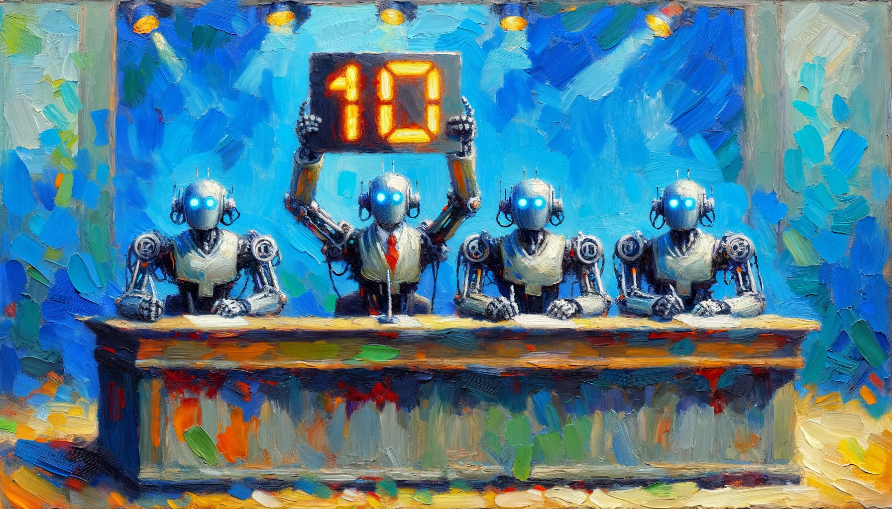

<banner class="page-header" role="banner">
  
</banner>

# Who Will Judge the Judges?

*UNFINISHED DRAFT*

One day when we put many smart chatbots into services to make important decisions for us, it is vital that we also build reliable check-and-balance mechanism into the system.

Aside from having humans as the ultimate judge of whether our welfare is being served, a secondary line of defense is to have

## What is *Ensemble GenAI*

<!-- <banner class="page-header" role="banner">
  
</banner> -->
