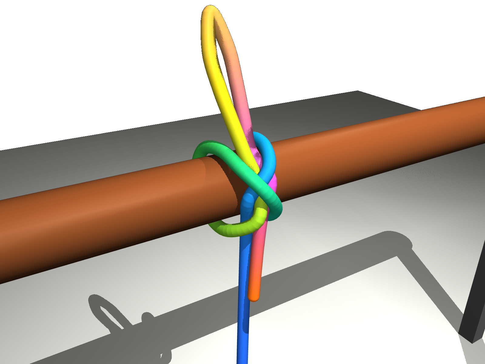

# Honey, About That Diaper-Changing Robot...

## Exploring general-purpose robot learning with VL+A and Human Dialog

When I was dating my future wife in an ancient era when programming meant punching physical cards, I told that sweet and infinitely trusting girl that I would build a robot to change our baby's diapers. Sadly it took a little longer than I expected, but it never left my mind. Thanks to the emergence of AI coding assistants, the project is back from the dead.

How should I approach this tough project? The popular approach, VLA (Vision-Language-Action models), is impressive, but it learns from mountains of robot training data, and I'm fresh out of mountains.

So I decided to try an approach I call VL+A. A general-purpose vision-language model (VLM) does the thinking: it reads the task instructions, proposes the steps and checks the outcomes, without being fine-tuned for each task. A separate component handles the acting and sensing, and a harness manages the learning and planning. I call the whole system Kith. It's meant to be a cognitive platform that works with any robot's hardware.

Like a good apprentice, Kith should learn its tasks and skills from instructions meant for people, such as a diagram, a manual page or a how-to video. A technician could hand a Kith-enabled robot the manual for a new inspection procedure, clear up the confusing steps in conversation, and expect those corrections to stick for the next job.

The part I most want to explore is Dialogic Learning: can a robot turn a human's clarification into a reusable lesson, figure out where that lesson applies (and where it doesn't), and use it on a later task? And can that work for complex tasks involving motion, timing and force?

As a first experiment, here's how Kith learned to tie a knot with a rope:

- I show Kith a four-panel drawing about how to tie a Slipped Constrictor Knot.
- Kith's VLM reads it and writes the task as plain steps in text, like *"two turns lie side by side over the rod and cross in an X on the front."*
- A second model critiques the steps, to make sure that the steps are clear. A model tries to follow the steps without seeing the picture and complains wherever it's confused.
- Kith's VLM picks the questions that matter most and asks me (as the resident human expert) for clarification. The first time, it guessed the rope went *over* a strand. Wrong: it goes under. I told it so and pointed out the giveaway, the arrow in the drawing disappearing behind the rope.
- My answers become written lessons. Kith doesn't fully trust a lesson until it holds up on pictures it wasn't taught on.
- Kith's VLM hands the steps to a robot one at a time (in a MuJoCo simulator for now) and checks each one with its own vision.
- In the reported simulator test, a steady 2-newton load made the knot slide about 4 cm before holding. Pulling the free end then released it, as intended. 
 
For this fisrt trial we used a shortcut for the physical manipulation, so it tests the interpretation-and-checking loop rather than autonomous knot tying by robot hands.

Notice that VL+A doesn't start by collecting mountains of training data. Kith first works out how to do a task correctly from a bit of instructional material and some advice from a human, then gets faster and smoother through practice, much as people do: first get it right, then get it quick. 

## What VL+A gives us

In VL+A, the VLM interprets instructions and checks outcomes, while a separate action system handles movement. Kith stores explicit task steps and lessons as text; perception and motion subcomponents (i.e., the Fast Eye and Skill Tuner) can be dynamically constructed and may still require relatively short training or tuning. This split brings some important benefits:

- **Transparent.** Kith stores explicit steps and lessons as readable text, with records of whether they were observed, supplied by a person, or tested. In this example, one human correction repaired a mistaken interpretation without fine-tuning the VLM.
- **Accessible.** Teaching resembles a conversation with an apprentice. In these trials, Kith asked targeted questions about ambiguous instructions and retained the answers as lessons that can be automatically converted into low-level skills. The aim is to let people teach tasks without writing code.
- **Rides the frontier.** When a better general-purpose model comes out, swap it in. The replacement VLM still needs evaluation, but it is much easier than redoing the training for each task.
- **Cheap to train** In the knot trial, a new task took a picture and a few answers, not hours of demonstrations.
In the knot trial, a diagram and a few human answers supplied the task instructions. For other type of tasks (e.g., juggling) the total cost also includes the action system, practice, and supporting perception, but those are much cheaper to train than find-tuning VLA or VA models.
- **Versatile.** Kith model is designed to learn from the teaching material people already make for each other: a diagram, a manual page, a how-to video, a few words of advice. The same machinery works across very different tasks, too. After the knots, Kith is now on its way learning how to juggle three balls with two arms.
- **Suitable for long, many-step tasks.** Kith keeps its own to-do list and its own memory of what it has seen and where things are, instead of asking the AI model to hold it all in its head. This is intended to help Kith work through tasks with many steps, pick up where it left off after an interruption, and notice when something it did earlier has come undone.
- **Portable.** Text-based lessons may transfer across robots and models, though each new combination still needs compatible action capabilities and validation.

## Where things stand

Early simulated experiments have shown promising results, and warrant further investigation of the approach.

Next, I want to test how well the same approach transfers to other tasks, and then move on to physical hardware. Juggling is particularly interesting because it requires precise timing and rapid feedback. Using two UR5e arms simulated in MuJoCo, I’m testing whether Kith can learn and refine a juggling strategy from instructions, images, practice, and advice from someone who cannot juggle. While robots that juggle are nothing new, this new way of training a robot can open many possibilities. More on this later.

As to the diaper changing thing, that remains a manual job for now, but it is still on my roadmap. Trust me!

<figure>
<video controls playsinline preload="metadata" style="max-width: 100%;">
  <source src="cascade-fast-eye-t53.webm" type="video/webm">
  Your browser does not support embedded video.
</video>
<figcaption>Kith trained itself to juggle three balls with text advices from human, no reinforcement learning used. Simulated in MuJoCo. </figcaption>
</figure>
