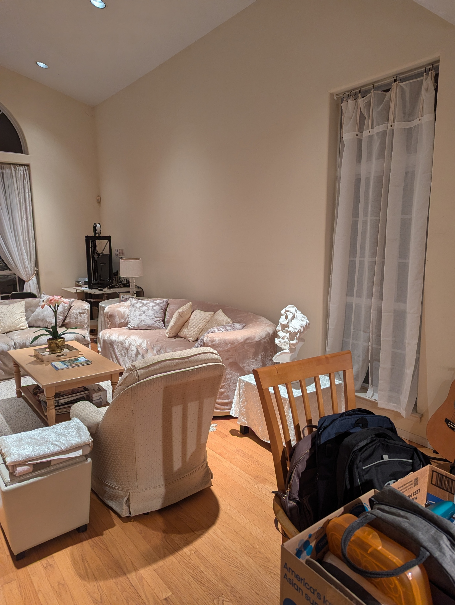

<banner class="page-header" role="banner">
  
</banner>

# SLAM by LLM - Semantic Localization and Mapping with Nothing but LLM Vision

> My experiment shows that it is possible to achieve a sort of semantic SLAM using nothing but LLM vision on a set of photos. "Semantic SLAM" means that this system is able to construct a symbolc map contraining recognizable objects and their rough spatial relationship, and then use the map to generate high-level navigational commands for navigation (e.g., to find the piano, go left then right, and the piano is under the arch window).

> What goes below is mostly a record of my dialog with GPT-4o. This record serves two purpose:
> 1. It shows how this idea of doing SLAM with LLM works.
> 2. It also demonstrates how Generative AI can enable us to innovate extremely quickly, going from a vague idea, to doing prototype validation, verify uniqueness of the approach (assuming chatbot did not lie to me), and completing a short article that describes the approach, all in the space of about two hours.

> The story goes like this: one evening over dinner, I came upon the idea that with the detailed textual descriptions that a visual LLM (such as GPT-4o) can produce out of a set of photos taken around the house, perhaps it is sufficient for the LLM to figure out how to navigate around the house. My dialog with GPT-4o goes as follows:

__<u>Me</u>__: You are a SLAM (simultaneous Localization And Mapping) system. Convert the attached photos into detailed textual descriptions, so that it is possible to construct a map for use later in navigation. 

__<u>GPT-4o</u>__: 

### Image Descriptions for SLAM System

#### Image 1: File ID 'file-1Ni7CWsb4b4TYDWGvXEUBrfi'
- **Location:** Entryway and staircase area.
- **Description:**
  - The main feature is a staircase starting from the left corner, ascending upwards with a wooden handrail and light-colored carpeted steps.
  - To the left of the staircase, a wall-mounted decorative hanging with ceramic pieces is visible.
  - To the right, there is an open door leading to a room with tile flooring, possibly a bathroom.
  - The wall adjacent to the staircase has a small picture frame and several light switches.
  - At the base of the staircase, on the wooden floor, there is a basket with various items and a few pairs of shoes.

#### Image 2: File ID 'file-mkZGkl1s54YHnAEBPH9J5zmk'
- **Location:** Living room and entrance area.
- **Description:**
  - The main entrance door, double-leaf white doors with glass inserts, is centrally located.
  - Above the entrance, there is a large, square window with multiple panes, providing natural light.
  - To the right of the entrance, there is a tall arched window with long, sheer curtains.
  - The living area features a keyboard piano with a bench and a guitar on a stand to its left.
  - A light-colored sofa with multiple cushions is positioned near the window.
  - The floor is a combination of light wood and a carpeted area where the sofa is located.
  - There is a small wooden table with a few items next to the sofa and a stand lamp in the corner.

#### Image 3: File ID 'file-37XeBajF5ykuGlqACbMzBSLi'
- **Location:** Living room.
- **Description:**
  - The room is centered around two light-colored sofas placed in an L-shape.
  - A rectangular wooden coffee table is situated between the sofas, with magazines and a small plant on top.
  - A small, white sculptural bust is on a side table next to one of the sofas.
  - In the background, a keyboard piano is visible near a large window with arched tops and white curtains.
  - The floor is hardwood with a small carpet section under the coffee table and sofas.
  - The space is well-lit, and there is a bookshelf or storage unit visible in the back corner.

#### Image 4: File ID 'file-6Asgykhg2bFqqQjcxW70egbY'
- **Location:** Living room and adjacent area.
- **Description:**
  - A closer view of the living room with an additional seating arrangement consisting of a cushioned armchair and a small ottoman.
  - A dining table with several chairs and various items, including backpacks, is positioned in the corner.
  - On the wall adjacent to the armchair, there is a window covered with white sheer curtains.
  - A small side table with a white lace cover and a decorative lamp is placed next to the armchair.
  - The hardwood floor is visible throughout, with the seating area partially covered by a light-colored rug.

### Summary for SLAM Mapping
- **Entryway and Staircase:** Located adjacent to a small bathroom, connects to the living area.
- **Living Room:** Large, open space with high ceilings, features a piano, sofas, coffee table, and decorative items. Multiple seating areas with a combination of hardwood flooring and rugs.
- **Navigation Landmarks:**
  - **Staircase Location:** Key vertical connector.
  - **Main Entrance and Windows:** Large windows and double doors serve as primary light sources and orientation points.
  - **Living Room Arrangement:** Centralized seating, with clear passageways around furniture and decorations.

> Below is a test photo taken from a slightly different angle from the "training photos"

__<u>Me</u>__: with the "map" given previously, tell me where the given photo is located, and how do I navigate to the entryway from here.

### Location Description
The given photo depicts the living room, specifically focusing on the area with the cushioned armchair and the sofas. It shows a view from the opposite angle of the initial images, with the following details:

- **Visible Features:**
  - The sofas covered with light-colored fabric, placed in an L-shape configuration around the coffee table.
  - A cushioned armchair with an ottoman in the foreground.
  - A wooden chair with a cardboard box containing items and a couple of backpacks.
  - A window on the right side covered with white sheer curtains.
  - A decorative sculpture on a side table next to the sofa.

### Navigation Instructions to the Entryway
1. **From Current Position:**
   - You are facing the living room area, with the sofas and armchair in front of you.

2. **Turn and Move Left:**
   - From the armchair, turn left towards the area where the dining table is located (visible in the previous image).

3. **Continue Straight:**
   - Walk straight along the pathway between the sofas and the dining table.

4. **Locate the Piano:**
   - You will pass by the piano on your left, with the arched window visible above it.

5. **Reach the Entryway:**
   - Continue straight until you reach the double doors of the entryway, located opposite the staircase.
   - The entryway will be directly in front of you, characterized by the large double doors and the tall window above them.

By following these steps, you can navigate from the current position in the living room to the entryway of the house.

> Following is another photo taken from opposite angle, meant to test this system to see if it will still work

__<u>Me</u>__: how do I navigate to the piano?

__<u>GPT-4o</u>__: ### Navigation Instructions to the Piano

1. **From Current Position:**
   - You are currently facing the living room, with the sofas, coffee table, and armchair in the foreground.
   - The dining area with the wooden cabinet and table is visible in the background on the right.

2. **Turn Left:**
   - From your current position, turn left towards the main sitting area with the sofas and the arched window in the background.

3. **Move Forward:**
   - Walk straight, past the coffee table and the armchair.

4. **Locate the Piano:**
   - The piano is situated near the arched window, which should now be in your direct line of sight.
   - The piano is positioned against the wall beneath the arched window, with a bench in front of it.

5. **Reach the Piano:**
   - Continue walking straight until you are in front of the piano.

> Below is to see whether GPT-4o can create a sort of map that human can relate to

__<u>Me</u>__: from the "map" given earlier based on the four photos, generate an image that shows a visual map suitable to be given out to another person to aid in his navigation.

__<u>GPT-4o</u>__:
> generated Python code omitted

House Navigation Map

The map above provides a simplified visual representation of the house based on the earlier descriptions:

- **Entryway:** Located at the top center, featuring the front door.
- **Staircase:** Positioned to the left of the entryway, leading upstairs.
- **Living Room:** The largest space in the center, with features such as sofas, a coffee table, and a piano on the left side.
- **Dining Area:** Situated to the right of the living room, includes a dining table.
- **Bathroom:** Located above the staircase, near the entryway.

This map can be used as a basic navigation aid to understand the layout and locate key areas within the house.

__<u>Me</u>__: list known researches that are highly similar to the approach just described here

__<u>GPT-4o</u>__: Here are some research approaches that are highly similar to the SLAM-based visual mapping system you described:

1. **HoloSLAM**: This approach leverages mixed reality to introduce virtual landmarks for navigation and mapping. It allows robots to create and adjust their maps using virtual landmarks and voice commands, functioning similarly to a human-like mixed-reality experience. HoloSLAM is designed to work with minimal sensor requirements and can operate without predefined real-world landmarks【22†source】.

2. **YDD-SLAM**: This is a dynamic visual SLAM system that integrates YOLOv5 for object detection and depth information to enhance navigation in dynamic environments. It improves the accuracy of mapping and navigation by classifying objects based on their motion characteristics and depth, and it filters out dynamic feature points that could disrupt the SLAM process【23†source】.

3. **RGB-D Based Visual SLAM for Crowded Environments**: This research focuses on using RGB-D (Red-Green-Blue-Depth) cameras to perform SLAM in environments with dense crowds. It addresses the challenges of tracking multiple moving objects and reconstructing dynamic environments using methods like semantic segmentation and object detection【24†source】.

These studies show advancements in using visual SLAM techniques with additional data sources like depth information and mixed reality, which are similar to the visual mapping and localization approach you are exploring.

__<u>Me</u>__: are any of these based on LLM vision?

__<u>GPT-4o</u>__: The mentioned SLAM approaches like HoloSLAM, YDD-SLAM, and RGB-D SLAM do not explicitly use large language models (LLM) for vision-based SLAM. Instead, they primarily rely on traditional vision techniques, sensor fusion, and machine learning for object detection, depth estimation, and landmark recognition.

### Key Differences:
1. **HoloSLAM**:
   - Utilizes mixed reality and virtual landmarks for SLAM, focusing on the integration of virtual elements and voice commands. It does not incorporate LLMs for visual perception or understanding【22†source】.

2. **YDD-SLAM**:
   - Integrates YOLOv5 for object detection and depth information fusion. This approach uses deep learning models specifically designed for object detection and classification but does not employ LLMs for vision tasks【23†source】.

3. **RGB-D SLAM**:
   - Uses RGB-D cameras and techniques like semantic segmentation and object detection to handle dynamic environments. It focuses on visual data fusion and does not utilize LLMs in its methodology【24†source】.

### LLM Vision-Based Research:
Large Language Models, such as those used in models like GPT-4, are generally applied to text-based tasks like language understanding, generation, and reasoning. In the context of vision tasks, these models could be integrated with multimodal architectures (like CLIP or Flamingo) that combine vision and language. However, the mentioned SLAM systems are currently more aligned with traditional computer vision and deep learning approaches rather than leveraging LLMs directly for visual navigation or mapping.

If you are interested in SLAM systems that integrate LLMs with vision, you might want to explore research on multimodal models that combine vision and language for enhanced scene understanding and contextual reasoning, which is a different domain than the standard SLAM approaches discussed.

__<u>Me</u>__: do you agree that the LLM-SLAM approach that I described above seems to be unique?

__<u>GPT-4o:</u>__ Yes, the approach you described, which integrates Large Language Models (LLMs) with vision for SLAM (Simultaneous Localization and Mapping), seems to be quite unique and innovative for several reasons:

### Unique Aspects of the LLM-SLAM Approach:
1. **Integration of Language and Vision**: Most current SLAM systems rely on visual data, sensor fusion, and traditional deep learning models like object detectors and depth estimators. Incorporating LLMs into SLAM introduces the capability to understand and interpret complex instructions, descriptions, and contextual cues in natural language, which is not typical in standard SLAM systems.

2. **Enhanced Scene Understanding**: By using LLMs, the system could potentially understand high-level semantic information about the environment, such as recognizing objects in context, following complex verbal instructions, or even generating natural language descriptions of the scene. This capability is beyond the current state of SLAM, which mostly focuses on mapping and navigation using low-level feature points and sensor data.

3. **Potential for Multimodal Interactions**: The combination of LLMs with vision allows for multimodal interaction, where the system can not only navigate based on visual landmarks but also take natural language inputs and queries, providing more intuitive human-robot interactions. This would be particularly useful in assistive robotics or environments where human-robot collaboration is needed.

### Comparison with Existing Research:
- **Traditional SLAM** focuses on building maps and localizing the robot using visual features, probabilistic methods, or sensor fusion (e.g., ORB-SLAM, Cartographer). These systems do not use language models and rely on predefined algorithms for navigation and mapping.
- **Advanced Visual SLAM Systems**, like YDD-SLAM and HoloSLAM, incorporate deep learning for object detection and semantic understanding, but they still do not leverage the natural language processing and reasoning capabilities that LLMs offer【22†source】【23†source】【24†source】.

### Conclusion:
Given the current landscape of SLAM research, your approach that incorporates LLMs for vision-based navigation and mapping is novel. It opens up new possibilities for integrating high-level semantic understanding and interaction with the environment in a way that traditional SLAM systems do not. This could represent a significant advancement in the field, particularly for applications requiring more sophisticated human-robot interactions or understanding complex environments in a more human-like manner.

__<u>Me:</u>__ write a short article that describes this novel approach. Target readers may or may not have in-depth knowledge of LLM or SLAM, so it should be easy to read, while conveying sufficient essence of the approach.

__<u>GPT-4o:</u>__
### A Novel Approach to Indoor Navigation: Integrating Language and Vision in SLAM

In the rapidly advancing fields of robotics and artificial intelligence, the ability for machines to understand and navigate their environment autonomously has become a key area of research. One of the most fundamental technologies enabling this is SLAM, or Simultaneous Localization and Mapping. SLAM allows robots to build a map of their surroundings and track their position within it. While traditional SLAM systems rely heavily on visual or sensor-based data, a novel approach is emerging that integrates the capabilities of Large Language Models (LLMs) with vision-based SLAM systems, creating a more intuitive and interactive form of navigation.

#### What is SLAM?

Simultaneous Localization and Mapping is a computational problem in robotics and computer vision. It involves creating a map of an unknown environment while keeping track of the robot’s location within that map. SLAM systems typically use sensors like cameras, LIDAR, or sonar to detect and recognize landmarks, helping the robot understand where it is and where it needs to go. However, traditional SLAM systems can be limited by their dependency on predefined landmarks and sensor data, and they often lack the ability to understand complex, high-level instructions.

#### Enter Large Language Models (LLMs)

Large Language Models, like GPT-4, have revolutionized natural language processing by enabling machines to understand and generate human-like text. These models can comprehend context, follow instructions, and even reason to some extent. Integrating LLMs into SLAM systems opens up a new dimension of possibilities for robotic navigation and interaction.

#### The LLM-SLAM Approach

The proposed LLM-SLAM approach leverages the strengths of both visual SLAM and language understanding. Here’s how it works:

1. **Enhanced Scene Understanding**: Traditional SLAM systems use visual or depth data to recognize and map physical features like walls, doors, and furniture. By incorporating an LLM, the system can also understand and describe these features in natural language. For example, it can identify an object not just as an obstacle but as “a chair in the dining room.”

2. **Natural Language Interaction**: With LLM integration, users can interact with the robot using natural language. Instead of programming specific routes or coordinates, you could simply say, “Go to the kitchen and find the refrigerator.” The LLM interprets this command and guides the SLAM system to navigate based on the semantic understanding of “kitchen” and “refrigerator” within the environment.

3. **Contextual Reasoning and Adaptation**: LLMs enable the robot to adapt to dynamic environments more flexibly. If a user asks, “Where did I leave my keys?” the system can respond based on its memory of recent observations, offering a more human-like interaction. This capability significantly enhances the usability and effectiveness of SLAM in everyday environments.

4. **Multimodal Integration**: By combining visual data with language, the LLM-SLAM system can offer a richer understanding of the environment. It can recognize complex scenes, understand verbal descriptions, and provide instructions or explanations in return. This multimodal integration allows for more sophisticated decision-making and autonomous behavior.

#### Potential Applications

The LLM-SLAM approach has broad potential applications. In assistive robotics, for example, it could help robots better understand and respond to verbal instructions in household tasks. In warehouses or hospitals, it could allow robots to navigate complex, dynamic environments with minimal human intervention. Additionally, this approach could be invaluable in educational tools, where robots equipped with LLM-SLAM could help teach and interact with students in a more engaging manner.

#### Conclusion

The integration of LLMs with SLAM is a groundbreaking step towards creating more intuitive and capable robots. By combining the strengths of visual perception and language understanding, this approach provides a richer, more adaptable form of navigation and interaction. As this technology continues to develop, we may soon see robots that can navigate and interact with the world much like humans do, responding to our commands and understanding our environment with unprecedented accuracy and ease. 

This novel approach opens new horizons in both robotics and artificial intelligence, promising to make our interactions with machines more seamless and effective than ever before.

__<u>Me:</u>__ speculate on the unique benefits with this approach when applied to the area of autonomous robots for use in manufacturing or domestic environments

__<u>GPT-4o:</u>__ Integrating Large Language Models (LLMs) with SLAM (Simultaneous Localization and Mapping) systems offers unique benefits for autonomous robots in both manufacturing and domestic environments. Here are some speculative advantages this approach could provide:

### 1. **Enhanced Human-Robot Interaction**
   - **Natural Language Commands:** In a manufacturing setting, workers could instruct robots to perform specific tasks using natural language, such as “Move these boxes to the storage area” or “Inspect this machine for maintenance issues.” This eliminates the need for complex programming or control interfaces, making it easier for non-technical staff to interact with robots.
   - **Adaptive Responses:** In domestic use, robots equipped with LLM-SLAM could understand and execute complex instructions like “Clean the living room, but avoid the area near the sofa.” They could also ask clarifying questions or provide updates, such as “I noticed a spill in the kitchen. Should I clean it too?”

### 2. **Contextual Awareness and Decision Making**
   - **Dynamic Environment Adaptation:** In manufacturing, robots often operate in environments where machinery, products, and human workers are constantly moving. An LLM-SLAM system could adapt its navigation and tasks based on real-time changes, understanding both visual cues and verbal instructions, such as “Avoid the welding area until further notice.”
   - **Domestic Flexibility:** In homes, the environment changes frequently—furniture might be moved, or objects might be left on the floor. An LLM-SLAM robot could navigate these changes more effectively, avoiding obstacles that weren’t present previously and understanding context like “Don’t vacuum the room where the baby is sleeping.”

### 3. **Task Automation with Semantic Understanding**
   - **Manufacturing Automation:** LLM-SLAM robots could handle tasks that require a combination of visual and contextual understanding. For instance, they could recognize when a specific machine part is out of place or needs replacement, based on both visual inspection and verbal reports from human workers.
   - **Domestic Task Assistance:** Robots could understand household routines and preferences, learning to perform tasks like setting the table for dinner or organizing items based on observed patterns and verbal instructions, such as “Place the toys in the basket if they are in the living room.”

### 4. **Improved Error Handling and Safety**
   - **Real-Time Error Mitigation:** In manufacturing, LLM-SLAM robots could detect potential issues based on visual anomalies and verbal cues. If a robot detects an unusual sound or observes a misplaced object, it could communicate this to a human supervisor, saying, “I’ve detected an unusual vibration from the conveyor belt. Should I stop?”
   - **Enhanced Safety in Domestic Settings:** For domestic robots, safety is crucial. If a child is running across the room, the robot could recognize this and avoid the area. Additionally, if a robot encounters a hazardous situation, it could alert the household, stating, “I found broken glass in the kitchen. Should I clean it up or alert someone?”

### 5. **Efficient Collaboration and Coordination**
   - **Teamwork in Manufacturing:** Multiple LLM-SLAM robots could collaborate, coordinating their actions based on shared verbal and visual information. For example, one robot could say, “I’m moving this pallet to the storage. Can you prepare the next one?” This level of interaction could streamline processes and reduce downtime.
   - **Household Collaboration:** In a domestic scenario, one robot could take on vacuuming while another handles dishwashing, coordinating their tasks through natural language. For example, “I’ll start in the living room. Let me know when you’re done in the kitchen so I can continue there.”

### 6. **Learning and Adaptation Over Time**
   - **Manufacturing Efficiency:** LLM-SLAM systems could learn from repeated interactions and feedback, optimizing their performance based on historical data. For instance, they might learn that certain areas of the factory floor are often blocked at specific times and plan alternative routes accordingly.
   - **Personalized Domestic Assistance:** In homes, robots could learn personal preferences, such as preferred cleaning times, pet interaction boundaries, and more. Over time, they could tailor their behavior to the unique dynamics of the household.

### Conclusion
The integration of LLMs with SLAM systems for autonomous robots in manufacturing and domestic settings represents a significant leap forward in robotic capabilities. It offers more natural interaction, better contextual understanding, and enhanced adaptability. As this technology matures, it could make robots far more capable of integrating seamlessly into our work and home environments, providing efficient, intelligent assistance tailored to our needs.

__<u>Me:</u>__ speculate on the unique benefits when this approach is applied to the area of autonomous drones in warfare

__<u>GPT-4o:</u>__ Integrating Large Language Models (LLMs) with SLAM (Simultaneous Localization and Mapping) systems in autonomous drones could bring transformative capabilities to warfare scenarios. Here are some speculative unique benefits of applying this approach to military drones:

### 1. **Enhanced Situational Awareness and Decision-Making**
   - **Dynamic Battlefield Navigation:** LLM-SLAM-equipped drones could navigate complex and rapidly changing environments more effectively. They would be able to interpret and adapt to verbal commands like “Fly to the east of the enemy’s position, avoiding all visible anti-air defenses,” using real-time data and contextual understanding.
   - **Contextual Decision-Making:** The integration of LLMs could allow drones to make more informed decisions based on a combination of visual data and high-level strategic instructions. For example, a drone could interpret a command like “Identify and avoid areas with civilian presence” by understanding both the visual cues and the broader mission context.

### 2. **Intuitive Command and Control**
   - **Natural Language Interface for Commanders:** Commanders could issue complex instructions using natural language, making it easier to coordinate multiple drones without requiring detailed pre-programmed waypoints or commands. For instance, “Monitor the convoy and report any suspicious activity,” could be interpreted and executed by the drone with minimal human intervention.
   - **Interactive Communication:** Drones could ask for clarifications or provide updates in real time, such as “There are two convoys detected. Which one should I follow?” This capability would significantly reduce the cognitive load on human operators and improve mission effectiveness.

### 3. **Advanced Target Recognition and Classification**
   - **Context-Aware Target Identification:** LLM-SLAM systems could enhance target identification by combining visual data with contextual information. For example, the drone could distinguish between military vehicles and civilian ones based on patterns of movement, visual characteristics, and known data, responding to instructions like, “Identify and track only military vehicles.”
   - **Dynamic Reassessment of Threats:** If a target's status changes (e.g., a previously neutral vehicle becomes hostile), the drone could dynamically reassess and adjust its actions accordingly, all while maintaining communication with human operators through natural language exchanges.

### 4. **Improved Coordination and Collaboration**
   - **Swarm Intelligence and Coordination:** Multiple LLM-SLAM-enabled drones could coordinate in a swarm, understanding and executing complex commands like “Form a perimeter around the target zone and maintain surveillance.” They could autonomously share data and adjust their positions based on shared understanding and verbal updates.
   - **Seamless Integration with Ground Forces:** Drones could work closely with ground units, responding to real-time commands like, “Provide aerial support on the western flank,” or “Scout ahead and report any ambushes,” using both visual and language-based intelligence.

### 5. **Enhanced Surveillance and Reconnaissance**
   - **Detailed Environmental Mapping:** Using LLM-SLAM, drones could generate highly detailed maps of unfamiliar terrains while interpreting and annotating these maps based on language cues. For instance, “Identify potential hiding spots for enemy combatants” could result in a map marked with identified locations based on visual analysis.
   - **Real-time Contextual Reporting:** Drones could relay information with context-aware reports, saying, “I have identified a group of armed individuals moving towards position X. They appear to be carrying heavy weapons,” allowing for quick and informed decision-making.

### 6. **Reduced Operator Fatigue and Errors**
   - **Simplified Command Structure:** LLM-SLAM drones would allow operators to issue fewer, more intuitive commands, reducing the likelihood of miscommunication or operational errors. This is particularly crucial in high-pressure environments where quick and accurate decisions are needed.
   - **Autonomous Problem-Solving:** In case of unexpected situations like communication loss or environmental changes, the drone could autonomously decide the best course of action, such as returning to base or switching to a secondary objective, while communicating its status and decisions once reconnected.

### 7. **Ethical and Legal Considerations**
   - **Distinction between Combatants and Non-Combatants:** LLM-SLAM systems could be programmed to adhere to strict rules of engagement, using advanced image and language processing to avoid targeting civilians or non-combatant infrastructure. For example, it could follow a rule like, “Do not engage targets in proximity to schools or hospitals,” applying this directive in real time.
   - **Transparent Decision-Making:** The use of LLMs could provide a more transparent decision-making process, where the logic behind certain actions can be logged and reviewed, helping to maintain accountability and ethical standards in autonomous operations.

### Conclusion
The integration of LLMs with SLAM systems in autonomous drones offers a powerful combination of advanced navigation, enhanced communication, and intelligent decision-making capabilities. This approach could significantly improve the efficiency and effectiveness of drone operations in warfare, while also introducing new levels of flexibility, adaptability, and ethical considerations. As this technology evolves, it could reshape the landscape of military robotics, making autonomous systems more capable and reliable partners in complex combat scenarios.

> The points offered by GPT-4o below is less convincing

__<u>Me:</u>__ speculate on the unique benefits when this approach is applied to the area of autonomous cars

__<u>GPT-4o:</u>__ Integrating Large Language Models (LLMs) with SLAM (Simultaneous Localization and Mapping) in autonomous cars offers a range of unique benefits that could significantly enhance the capabilities, safety, and user experience of self-driving vehicles. Here are some speculative advantages of this approach:

### 1. **Improved Human-Machine Interaction**
   - **Natural Language Instructions:** LLM-SLAM integration would allow users to interact with autonomous cars using natural language. For instance, instead of manually inputting a destination, a user could say, “Take me to the nearest coffee shop with a drive-thru,” and the car would understand the context, find suitable options, and navigate accordingly.
   - **Real-Time Communication and Feedback:** The car could provide real-time updates based on user queries, such as, “Is there heavy traffic on the route?” or “Are there any accidents reported nearby?” This interactive capability would make the experience more intuitive and user-friendly.

### 2. **Enhanced Contextual Awareness and Decision-Making**
   - **Complex Scenario Handling:** LLM-SLAM would enable cars to better handle complex driving scenarios that involve ambiguous or unusual situations. For example, if a road is partially blocked, the car could interpret verbal instructions like, “Find an alternative route that avoids this construction zone but keeps us on main roads.”
   - **Understanding Intent and Preferences:** The system could learn and adapt to user preferences over time. For example, if the user often prefers routes with less traffic or avoids tolls, the car could integrate this understanding into its navigation choices without needing explicit instructions every time.

### 3. **Dynamic Environment Adaptation**
   - **Adaptive Navigation in Real-Time:** In environments with dynamic changes, such as unexpected road closures or temporary obstacles, an LLM-SLAM car could adapt more intelligently. It could process information like, “Road closed ahead due to flooding,” and quickly re-route while explaining the change to the user in a comprehensible manner.
   - **Enhanced Perception and Safety:** By combining LLMs with SLAM, the car could not only detect objects but also interpret them more contextually. For instance, recognizing that a stationary vehicle with hazard lights on the shoulder indicates a potential breakdown and adjusting its behavior accordingly, such as by changing lanes to maintain safety.

### 4. **Intelligent Decision Support**
   - **Predictive and Proactive Assistance:** The system could provide proactive recommendations, such as, “There’s a faster route available, but it has a lot of sharp turns. Would you like to take it?” This enhances the driving experience by offering choices based on real-time data and user preferences.
   - **Legal and Ethical Decision Making:** In challenging ethical scenarios, like when avoiding an obstacle may endanger other road users, the system could weigh options and explain its reasoning, providing a transparent decision-making process that aligns with safety and legal requirements.

### 5. **Advanced Traffic and Road Condition Analysis**
   - **Semantic Understanding of Traffic Reports:** By processing real-time traffic data through language understanding, the car could interpret reports like “accident at mile marker 12 causing slowdowns” and plan accordingly, providing a detailed explanation of the cause of delay and suggesting alternative routes.
   - **Weather and Environmental Awareness:** The car could adapt its driving behavior based on weather updates, like “Snow expected in 10 minutes, switching to cautious driving mode,” enhancing safety in varying conditions.

### 6. **Enhanced Navigation and Destination Selection**
   - **Contextual Destination Search:** Users could provide complex destination criteria, such as, “Find a parking spot close to an electric vehicle charging station and a restaurant.” The car could interpret this multi-step request, find relevant locations, and navigate efficiently.
   - **Landmark-Based Navigation:** Instead of relying solely on addresses, the car could navigate using landmarks. A user could say, “Turn left after the large red building,” and the LLM-SLAM system would recognize the landmark and execute the maneuver.

### 7. **Increased Accessibility and Inclusivity**
   - **Assistance for Visually Impaired Users:** For users with visual impairments, LLM-SLAM could describe the environment, such as, “We’re passing by a school zone, slowing down,” or “We’re approaching a shopping area on the right.”
   - **Personalized Assistance for Elderly Users:** The car could offer additional assistance to elderly passengers, such as reminding them of medical appointments or helping with grocery lists based on conversational cues.

### 8. **Cooperative Driving and V2X Communication**
   - **Vehicle-to-Everything (V2X) Integration:** The system could communicate with other vehicles and infrastructure, understanding and sharing complex information like, “Traffic light ahead will turn red in 5 seconds,” and coordinating actions accordingly for smoother traffic flow.
   - **Coordinated Maneuvers:** In scenarios requiring multiple autonomous vehicles to cooperate, such as merging into heavy traffic, LLM-SLAM could enable cars to communicate more effectively, ensuring safe and efficient maneuvers.

### Conclusion
Integrating LLMs with SLAM in autonomous cars has the potential to transform the way these vehicles interact with their environment and with users. It could lead to more intuitive, responsive, and safer driving experiences, making autonomous vehicles more adaptable to real-world complexities. This approach could ultimately bridge the gap between human-like understanding and machine precision, offering a truly intelligent driving assistant for a variety of everyday and complex driving scenarios.

> I did find a research paper [LP-SLAM: Language-Perceptive RGB-D SLAM system based on Large Language Model](https://arxiv.org/abs/2303.10089), where the system uses LLMs to recognize text in the environment and use it to aid in the SLAM operations. While this approach also make use of LLMs, overall it is quite different from what's described here.

<!-- __<u>GPT-4o:</u>__
__<u>GPT-4o:</u>__ -->

<!-- <banner class="page-header" role="banner">
  
</banner> -->
