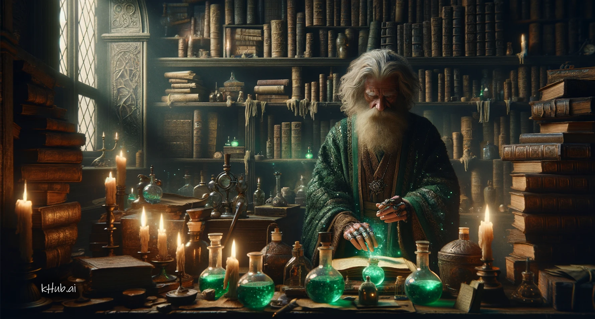

<banner class="page-header" role="banner">
  
</banner>

*DRAFT*

# The Alchemy of Prompting in Multimodal Language Models

<!-- Writing a prompt for a multimodal LLM (i.e., LMM) may not be straightforward, since the context in the prompt or the context in the given image all may affect the model's judgement when performing image-to-text conversion. In addition, when a given image contain a complex scene, the model may make mistakes until its attention is properly directed to the right spot. Please proceed to expand on these ideas and write a complete article to cover all sorts of intricate behaviors in LMM prompting. -->

## Introduction:

The advent of multimodal language models (LMMs) has introduced a paradigm shift in human-computer interaction, enabling systems to understand and generate content that combines language and vision. These models, which can process and produce both text and images, are revolutionizing the way we interact with AI. However, crafting prompts for LMMs is not always straightforward. The performance of these models can be heavily influenced by the context provided in the prompt or inherent in the image. Moreover, when an image contains a complex scene, guiding the model’s attention appropriately is crucial to avoid misunderstandings and errors. This article delves into the intricacies of prompting in LMMs, exploring how to effectively communicate with these systems to achieve desired outcomes.

## Contextual Considerations in LMM Prompting

When interacting with a LMM, the context can come from two sources: the text prompt and the visual input. The text prompt serves as a directive for the model, shaping the nature of the output. The image provides a visual context that the model interprets in conjunction with the text. It is essential to balance these inputs to avoid context clashes, where the model receives mixed signals about the intended task.

One of the primary challenges in multimodal prompting is ensuring that the context provided in the text aligns with the visual elements of the image. Discrepancies between the two can lead to confusion and inaccurate outputs. For instance, asking the model to describe a serene landscape when the image depicts a bustling cityscape may result in a disjointed or incorrect description.

## Directing Attention in Complex Scenes

Complex scenes in images present a unique challenge for LMMs. These models, while sophisticated, may not inherently know which elements of the image are most relevant to the user's inquiry. As such, it is crucial to direct the model's attention to the correct aspect of the image.

For example, if an image contains multiple subjects or actions, the prompt should specify which subject or action to focus on. This can be achieved through explicit instructions within the prompt or by asking questions that narrow the model's scope of interpretation.

## The Art of Precision and Brevity

An effective prompt should be both precise and concise. Precision ensures that the model's attention is focused correctly, while brevity avoids overloading the model with unnecessary information that could dilute its focus. The prompt should act as a clear guide without leading the model down irrelevant paths.

## The Relationship Between Detail and Ambiguity

Detail in a prompt can be a double-edged sword. On one hand, providing detailed descriptions can enhance the model's understanding and lead to richer outputs. On the other hand, excessive detail can introduce ambiguity, especially if it conflicts with what is visually evident in the image. Balancing detail and clarity is thus essential in LMM prompting.

## Error Handling and Iterative Prompting

When a LMM misinterprets a prompt, it is often beneficial to engage in iterative prompting. This involves adjusting the prompt based on the model's output to refine its focus or correct misunderstandings. This feedback loop can gradually guide the model towards the desired interpretation.

## Conclusion

Prompting in multimodal language models is an art that requires a deep understanding of how textual and visual contexts interact. As these models continue to evolve, so too will our strategies for communicating with them. By considering the context, directing attention, maintaining precision and brevity, balancing detail, and engaging in iterative prompting, we can harness the full potential of LMMs. The future of human-AI interaction will undoubtedly be enriched by our growing proficiency in navigating the nuances of multimodal prompts.

<!-- <banner class="page-header" role="banner">
  
</banner> -->
