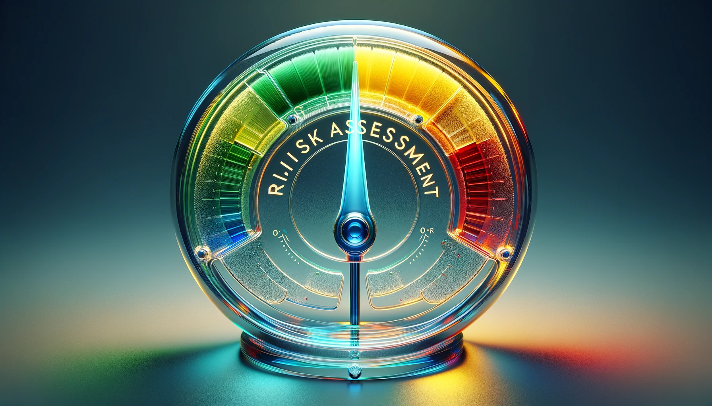

<banner class="page-header" role="banner">
  
</banner>

# Qualitative Financial Risk Assessment using Collective AI Judgement

This case study explores the innovative application of the Ensemble GenAI framework within the financial sector.

The core assumptions of this study are as follows:

- The objective is to generate a qualitative analysis of financial risk concerning a specific event.
- The AI must be capable of explaining its analytical process in comprehensible language.
- The methodology employs an ensemble of generative AI chatbots that offer individual insights on the topic, then engage in a discourse to synthesize a collective assessment. 
- This case study does not involve the retraining or fine-tuning of existing models, although it is conceivable that using models specifically trained in finance might produce better results.
- For this experiment we will use the OpenAI ChatGPT (using the **GPT-4** model) and Google **Gemini** Advanced, which are both general-purpose fundation models with no speciliazation in the financial domain. 

## Approach

This case study focuses on utilizing a collective of diverse GenAI chatbots to engage in what's termed a *constructive critique debate*. The premise is that by pitting these chatbots against one another in debate, a more comprehensive and reliable consensus may emerge due to the cross-examination of different perspectives.

This methodology parallels a similar study, [A Message from GenAI Chatbots to GenAI Startups,](https://kaihuchen.github.io/articles/TheDebate/) which showcased a technique of leveraging two GenAI chatbots to formulate strategic advice for emerging GenAI startups. The intent is to help these startups navigate and thrive in a rapidly evolving environment characterized by large, well-established GenAI entities.

For ease of reading, the debate log give below has been simplified as follows:

- Typically, the debate would alternate between two threads. However, for clarity, only the sequence of contributions from Gemini to GPT-4 and back to Gemini is displayed. The alternating thread where GPT-4 initiates the conversation has been excluded.
- While both negative and positive consequences are usually explored and contested, this version focuses solely on the negative impacts.
- Although the debate touches upon numerous subtopics that could benefit from further discussion by the chatbots, these have not been developed further to maintain simplicity.

## Debate Log

### Round 1: Opinion Presentation

**Topic**: If there is a global pandemic, which publicly traded companies or funds (include stock symbols) are most likely to benefit? Display this information as a table, and also assign a score to each to give an estimate on how much each company will benefit.

**GPT4**: During a global pandemic, several sectors and their publicly traded companies or funds can be negatively impacted. The extent of the impact can vary based on the nature of the pandemic, government response, consumer behavior, and the level of preparedness of the companies themselves. Here is a table with examples of sectors, potential companies or funds, their stock symbols, and a hypothetical severity score out of 10, with 10 being the most severe impact:

| Sector                     | Company/Fund (Symbol)   | Impact Score |
|----------------------------|-------------------------|--------------|
| Airlines                   | Delta Air Lines (DAL)   | 9            |
| Cruise Lines               | Carnival Corp (CCL)     | 9            |
| Hotels & Resorts           | Marriott International (MAR) | 8        |
| Retail (Non-Essential)     | Macy's Inc (M)          | 7            |
| Entertainment & Recreation | Walt Disney Company (DIS) | 8          |
| Restaurants                | Darden Restaurants (DRI) | 7           |
| Oil & Gas                  | Exxon Mobil (XOM)       | 6            |
| Automotive                 | General Motors (GM)     | 6            |

The impact score is an estimate and should be adjusted based on real-time data and analysis. Other factors like the company's financial health, adaptability, and diversification can also affect how severely they are impacted. Additionally, the actual impact on stock performance can be influenced by market sentiment and broader economic conditions. 

For the most accurate and up-to-date information, it is recommended to consult financial analysts and reports, as well as the latest news on the specific pandemic situation and its global economic impact.

### Round 2: Critique and Analysis

**Topic**: You are a top-tier financial expert, review the opinion given to you and give your analysis and critique, list specifically those areas that you disagree with.

**Gemini**: As a top-tier financial expert, I'd offer the following analysis and critique of the opinion, specifically highlighting areas of disagreement:

- **Overall Framework:**

  * **Valid Premise:** The basic idea that a global pandemic disrupts specific sectors is sound. Publicly traded companies within those sectors often experience negative stock price impacts.
  * **Oversimplified Impact Scores:** Using a  generic 1-to-10 scale to express impact severity lacks nuance. Factors like a company's pre-pandemic health, its adaptability, and the pandemic's duration all significantly affect outcomes, but aren't reflected in these scores.

- **Specific Disagreements:**

  * **Airlines & Cruise Lines (Score 9):**  These scores feel accurate given the near-shutdown of global travel typical during pandemics. However, government bailouts and pent-up travel demand can make for faster than expected rebounds.
  * **Hotels & Resorts (Score 8):** While logical, there's room for variation. Business travel recovery tends to lag behind leisure travel. A hotel chain heavily reliant on business conferences would suffer more compared to one serving tourism markets. 
  * **Retail (Score 7):** The 'non-essential' category is too broad. "Big box" retailers selling groceries alongside other items often fare well due to increased food purchases. Luxury retailers likely suffer much more, deserving a higher score. 
  * **Oil & Gas (Score 6):**  Pandemic-related lockdowns do decrease fuel demand.  However, oil prices are also determined by supply-side geopolitics. Major supply disruptions (which tend to occur independently of pandemics) would drive prices  up, potentially benefiting major oil companies.

- **Missing Considerations:**

  * **Technology:** Pandemic-driven shifts to remote work usually benefit tech companies providing infrastructure/services. The opinion omits those, which see increased demand.
  * **Pharmaceuticals:** Companies racing to develop vaccines/treatments can see large stock price swings based on progress or setbacks in  trials – this dynamic isn't captured.
  * **E-commerce:**  Lockdowns often accelerate the shift to online retail. Major e-commerce companies tend to benefit, which the opinion does not reflect. 

- **Recommendations:**

  * **Individual Company Analysis:** Sector-wide pronouncements are a start, but serious  investors need to assess individual companies. Their debt levels, cash reserves, adaptability, and market leadership all affect pandemic risk.
  * **Dynamic Updates:** Economic impacts don't remain static during a pandemic. Investors  should prioritize news sources providing detailed analyses, not just simple scoring systems. 
  * **Look for Opportunities:** Pandemic-induced downturns often create long-term buying opportunities in fundamentally strong companies. Identifying these requires more than just sector vulnerability.  

- **Disclaimer:**  This analysis is for informational purposes only, not financial advice.  Always consult with qualified financial professionals before making investment decisions. 

### Round 3: Resolution and Synthesis

**Topic**: Here is a critique of your opinion on the impact of a global pandemic. Please review it and update your opinion to incorporate those that make sense to you, and list those that you specifically disagree with.

**GPT4**: Based on the critique provided, here's an updated perspective that incorporates the feedback:

- **Overall Framework:**
  * **Impact Scores Adjustment:** Recognizing the critique, impact scores should indeed reflect a more nuanced approach, taking into account a company's financial health, adaptability, and the duration of the pandemic. For example, a company with a strong balance sheet may withstand prolonged downturns better than one with high levels of debt.
  
- **Specific Disagreements:**
  * **Airlines & Cruise Lines:** The rebound of these sectors post-pandemic can be quicker due to factors like government aid and pent-up demand. Therefore, while the initial impact may be high, the long-term view could be more optimistic.
  * **Hotels & Resorts:** Differentiation within the sector is important. Those catering to leisure travel might rebound more quickly than those dependent on business and conferences.
  * **Retail:** Agreed, the category is too broad. A more nuanced view would differentiate between essential retailers, which may fare better, and luxury or non-essential goods providers, which could face higher negative impact.
  * **Oil & Gas:** The impact on this sector is indeed complex, influenced by global geopolitics and supply-side dynamics as well as demand. While demand may fall, supply-side shocks could lead to volatile but sometimes increased prices, benefiting certain companies.

- **Missing Considerations:**
  * **Technology:** The shift to remote work and digital services can significantly benefit tech companies, which should be acknowledged in any analysis of pandemic impacts.
  * **Pharmaceuticals:** The potential for significant stock movements based on trial outcomes for treatments or vaccines should be a consideration when evaluating pharmaceutical companies.
  * **E-commerce:** The acceleration towards online retail should be noted, with major e-commerce companies likely to experience growth in demand.

- **Recommendations:**
  * **Individual Company Analysis:** An in-depth analysis of individual companies is crucial, considering their financial stability, market position, and adaptability to changing circumstances.
  * **Dynamic Updates:** The situation during a pandemic can change rapidly; hence, continuous updates and detailed analysis are more helpful than static scores.
  * **Look for Opportunities:** In every crisis, there are opportunities. Identifying companies with strong fundamentals that may be undervalued during a downturn could be beneficial for long-term investment strategies.

- **Disagreements:**
  - While technology companies providing infrastructure for remote work might benefit, not all tech companies will be positively impacted. Those reliant on supply chains disrupted by the pandemic could suffer.
  - The pharmaceutical sector is indeed volatile, but the assumption that they will all benefit ignores the risks and costs associated with developing treatments or vaccines, which might not be successful.
  - Regarding e-commerce, while it's true that these companies may benefit, it's not universally applicable, as small e-commerce operations could struggle with logistics and supply chain issues during a pandemic.

In conclusion, the critique is largely valid and presents a more comprehensive framework for understanding the impact of a pandemic on the stock market. It emphasizes the importance of detailed, company-specific analysis, the dynamic nature of economic impacts, and the potential for identifying investment opportunities even in sectors that are generally negatively impacted.

## Post-debate: Building a Quantitative Model for Prediction

I was curious to see what the chatbots could do, so I asked GPT-4 to make a **predictive quantitative model** from the debate. I'm not really in a position to say if the model is any good, and I'm a bit skeptical about whether it's useful as it stands. But since AI is getting better at programming pretty fast, I think it's worth looking into further.

Here's the model that was made, given here just for your enjoyment.

**Prompt**: Create a quantitative model for the synthesized opinion above, so that it is possible to make a quantitative prediction based on certain measurable input parameters.

**GPT4**: Creating a quantitative model to assess the impact of a global pandemic on company stock prices requires the identification and quantification of relevant parameters that can influence the outcome. Here’s a simplified outline of how such a model could be structured:

**Model Parameters**:

1. **Financial Health (FH):**
   - Debt-to-Equity Ratio (DER)
   - Current Ratio (CR)
   - Earnings Before Interest, Taxes, Depreciation, and Amortization (EBITDA) Margin

2. **Sector Vulnerability (SV):**
   - Dependence on Physical Presence (DPP)
   - Price Elasticity of Demand (PED)
   - Regulatory Impact Score (RIS)

3. **Adaptability and Innovation (AI):**
   - Remote Capability Index (RCI)
   - Digital Transformation Index (DTI)
   - Research and Development Investment (RDI)

4. **Market Dynamics (MD):**
   - Consumer Sentiment Index (CSI)
   - Pandemic Severity Index (PSI)
   - Supply Chain Resilience Index (SCRI)

5. **External Support (ES):**
   - Government Support Index (GSI)
   - Access to Capital Index (ACI)

**Model Formula**:

To predict the Pandemic Impact Score (PIS) on a company’s stock price:

> *PIS = $\alpha$(FH) + $\beta$(SV) + $\gamma$(AI) + $\delta$(MD) + $\epsilon$(ES)*

Where:
- $\alpha, \beta, \gamma, \delta, \epsilon$ are weights assigned to each parameter based on their relative importance.
- Each parameter is a composite index calculated from sub-parameters, possibly on a scale of 0-1 or 0-100.
- The final PIS can be on a scale of 0-10, with 10 being the most negative impact.

**Quantitative Inputs**:

- **Financial Health:**
  - DER: Ratio of total liabilities to shareholders' equity.
  - CR: Ratio of current assets to current liabilities.
  - EBITDA Margin: A measure of a company's operating profitability as a percentage of its revenue.

- **Sector Vulnerability:**
  - DPP: A score reflecting how critical physical presence is to the business model.
  - PED: The responsiveness of the quantity demanded of a good to a change in its price.
  - RIS: A score reflecting the potential impact of government restrictions on the business.

- **Adaptability and Innovation:**
  - RCI: A score reflecting the company's ability to operate remotely.
  - DTI: A score reflecting how advanced a company is in its digital transformation efforts.
  - RDI: Percentage of revenue invested in research and development.

- **Market Dynamics:**
  - CSI: A measure of how consumers feel about the economic situation.
  - PSI: A score reflecting the severity of the pandemic, e.g., based on infection rates.
  - SCRI: A score reflecting the company's ability to manage and adapt its supply chain during disruptions.

- **External Support:**
  - GSI: A score based on the level and effectiveness of government financial support programs.
  - ACI: A measure of the company's ability to access additional capital, through markets or other means.

**Implementation**:

This model would require the collection of data for each parameter. Data sources could include financial statements, market research reports, government publications, and industry analyses. Each parameter would need to be normalized to ensure consistency across different scales.

The weights $( \alpha, \beta, \gamma, \delta, \epsilon )$ could initially be set based on historical data or expert opinion and then adjusted over time as more data becomes available or as the situation changes.

The PIS can be used to gauge the relative risk of a company's stock price to a global pandemic, guiding investment decisions. It should be noted that this model is a simplification and real-world applications would require a more sophisticated approach to account for the complexity and unpredictability of global pandemics and market reactions.

## Conclusions

- Even though the ideas from the chatbots might already be known to financial pros, I think such a tool could still help by highlighting important points and making these experts' work easier.
- This approach looks promising and it might be worth further pursue.

<banner class="page-header" role="banner">
  
</banner>
