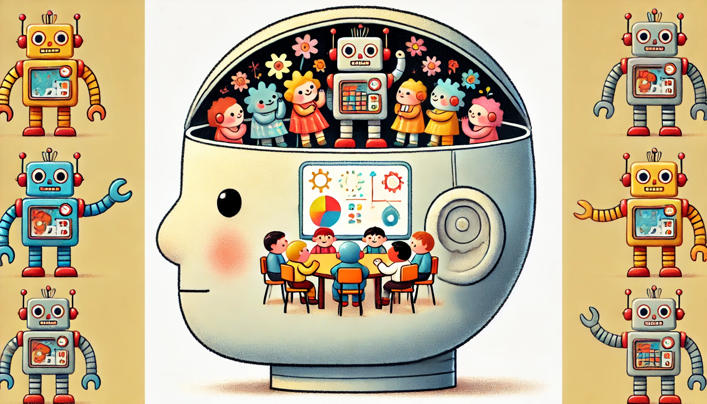

# How to Create a GenAI Go-To-Market Playbook Using a Multi-Role Chatbot

<banner class="page-header" role="banner">
  
</banner>

Article: [How to Create a GenAI Go-To-Market Playbook Using a Multi-Role Chatbot](https://kaihuchen.github.io/articles/SchizoBot/)
  - Revolutionize your Go-To-Market strategy with a multi-role chatbot that simulates stakeholder collaboration—an innovative approach also applicable to policy development, product design, project management, and more!
