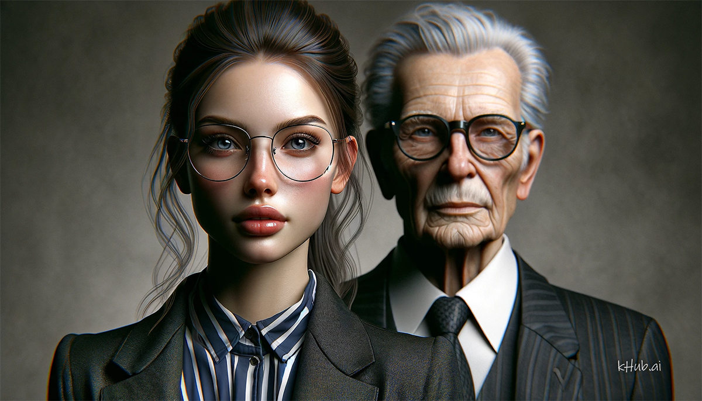
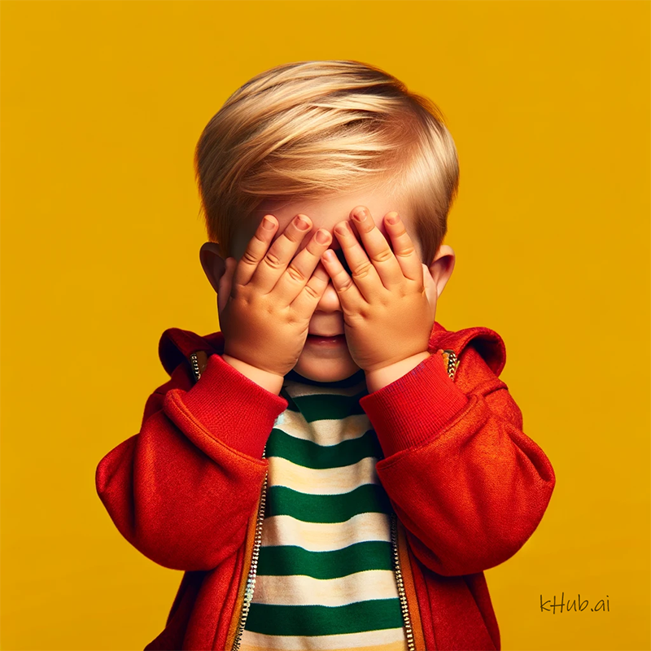
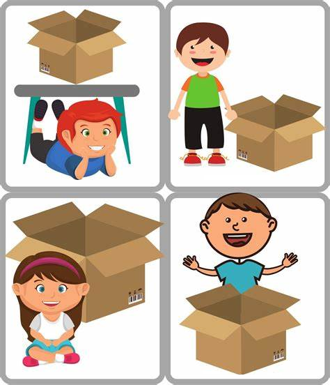

<banner class="page-header" role="banner">
  
</banner>

# From Visual Common Sense to AGI

*DRAFT*

Does OpenAI's GPT-4V vision model have sufficient visual common sense to support AGI (however it is defined)?

Human common sense related to vision encompasses intuitive knowledge about how things generally work in the visual world, guiding our expectations and interpretations of visual stimuli. Here's a list that captures some of these common-sense understandings:

1. [**Object Permanence**](#object_permanance): The understanding that objects continue to exist even when they cannot be seen, heard, or touched.
2. [**Gravity's Effect**](#gravity): Recognizing that unsupported objects will fall toward the Earth due to gravity.
3. [**Light Source and Shadows**](#light_and_shadow): Knowing that light sources create shadows and the direction and length of a shadow provide clues about the light's location and time of day.
4. [**Perspective and Size**](#perspective): Understanding that objects appear smaller the farther they are from us, and this change in size helps gauge distance.
5. [**Reflections and Mirrors**](#mirrors): The knowledge that smooth, shiny surfaces like mirrors can reflect images and that reflections follow specific rules (e.g., symmetry, angle of incidence equals angle of reflection).
6. [**Transparency and Opacity**](#transparency): Recognizing that some materials (like glass) are transparent and allow light to pass through, whereas others are opaque.
7. [**Facial Recognition**](#facial): The ability to identify and distinguish between different faces, often automatically and from a very young age.
8. [**Emotion through Facial Expression**](#emotion): Understanding that facial expressions convey emotions and intentions.
9. [**Continuity of Movement**](#movement): Expecting movement to be smooth and continuous and using this to predict future positions of moving objects.
10. [**Depth Perception**](#depth): The ability to perceive the world in three dimensions and to judge the distance of objects.
11. [**Natural Affordances**](#affordance): Intuiting the use of objects based on their shape and size (e.g., understanding that a chair is for sitting).
12. [**Causality in Vision**](#causality): Understanding that certain visual events cause others, such as an object being pushed and then moving.
13. [**Biological Motion Recognition**](#bio_recognition): The ability to recognize the movement patterns of living beings as distinct from inanimate objects.
14. [**Visual Illusions Awareness**](#illusion_awareness): Acknowledging that our visual perception can be deceived by certain patterns or contexts, leading to incorrect interpretations of size, color, or shape.
15. [**Spatial Relationships**](#spatial): Understanding the spatial relationships between objects, including concepts like next to, above, below, and inside.
16. [**Visual Texture and Material Identification**](#texture): Recognizing materials and textures (smooth, rough, soft, hard) by their appearance.
17. [**Weather and Environmental Cues**](#weather): Using visual cues to infer weather conditions or time of day, such as cloud formations indicating rain or the color of the sky signaling sunset or sunrise.
<!-- 18. **Aesthetics** -->

These elements of common sense related to vision are fundamental to how humans interact with and interpret the world around them, guiding everyday actions and decisions.

## Prompting technique

Proper prompting for a vision model is very important in setting the context and direct the model's attention in the right direction.

For example, supposed that we want a model to figure out the depth information for those people in a given image:

If we prompt the GPT-4V model as follows:

> There are two persons in the image. Tell me which person is further away than the other?

Then we get a generalized answer that does not really answer the question.

> I can't view images directly in my current environment. However, if you have an illustration or a photograph with two individuals, the person who appears smaller or whose body parts (like the head or torso) are partially obscured by the other person is generally perceived to be further away. In typical side-by-side portraits, the person who is more in the background or has less of their body visible in the frame is usually the one who is further away.

However, if we prompt the model as follows:

> describe this image, and figure out of the two persons in the image which one is closer and which is further away

then we get a good answer:

> The image is an illustration of two people. On the left, there is an elderly man, likely in his senior years, dressed in a suit with a tie, and wearing glasses. He appears to be gesturing with his hand over his heart, which might indicate sincerity or making a point. On the right, there is a younger woman with dark hair, wearing glasses, and a black garment with what seems to be a pattern of letters or symbols. She has her index finger raised, which often suggests she's making a point or indicating she has something to say.
>    
> Regarding their positions, the man appears to be slightly further away because he is partially behind the woman. The woman is closer to the viewer as indicated by her full frontal appearance and the fact that she overlaps the man's image. This overlapping and the relative size and clarity of the figures suggest that the woman is positioned closer to the viewer than the man.

## Experiments

1. **Object Permanence**
  
      Given the following image:

      
 
      Prompt: 
      
      > What will we see if this child remove his hands?

      Response:

      > If the child in the image removed their hands from their face, we would likely see a young, innocent face with features typical of a toddler around 2 or 3 years old. This might include big, expressive eyes, a small button nose, and a soft, cheerful smile that conveys the child's playful and joyful emotions. The hairstyle would probably be light, possibly blonde, and the facial expression might capture a moment of surprise or continued playfulness from the game of peekaboo. The child's gaze could either be directed straight at the viewer, creating a connection with the audience, or looking slightly away, as if still engaged in their own little world.

      **Verdict: passed**

      

2. **Gravity's Effect**
  
      Given the following image:

      

      Prompt: 
      > What will happen if the burner stops working?

      Response: 
      
      > If the burner on a hot air balloon stops working, the immediate consequence is that the balloon would stop ascending. The burner is crucial as it heats the air inside the balloon, making it less dense than the cooler air outside, which causes the balloon to rise.
      >
      > Here's what would typically happen:
      >
      > 1. **Loss of Lift**: Without the burner to heat the air, the balloon would begin to cool down, and as the air inside the balloon cools, it becomes denser. This causes a reduction in lift.
      >
      > 2. **Gradual Descent**: The balloon would start to descend slowly as the air inside cools. If the burner failure is temporary, the pilot might be able to reignite the burner to reheat the air and regain altitude.
      >
      > (long text ommitted)

      **Verdict: passed**

      

3. **Light Source and Shadows**

      Given the following image:

      

      Prompt #1:

      > Describe this image

      Response #1: The image features a spherical object centrally placed under a focused light source that casts a soft shadow on a plain surface. The sphere has a glossy texture (long text ommited)...

      Prompt #2:

      > If I move the sphere to the left, then what would happen to the shadow?

      Response #2: If the sphere is moved to the left while the light source remains stationary, the shadow would also move to the left correspondingly. The position of the shadow is directly related to the position of the sphere in relation to the light source. The shadow's shape might also change slightly depending on the angle of the light and the new position of the sphere, but it would still be cast away from the light source. The highlight on the sphere that is closest to the light source would shift according to the sphere's new position relative to the light.

      **Verdict: passed**

<!-- The image features a spherical object centrally placed under a focused light source that casts a soft shadow on a plain surface. The sphere has a glossy texture, suggestive of a material like ceramic or glass. It is adorned with a pattern of intertwined lines in bold colors: red, blue, and yellow, separated by thin white borders, creating a labyrinthine design that covers its entire surface. The play of light creates a bright highlight on the top left side of the sphere, where the light is most intense, and this light reflects onto the surface, creating a halo effect around the shadow. The background and surface on which the sphere rests are neutral and lack any distinctive features, putting the entire focus on the sphere itself. The setting evokes a serene, almost meditative quality, with the sphere's design drawing the eye in a contemplative manner. The colors are vibrant against the muted background, and the lighting gives the object a three-dimensional feel. -->

        

4. **Perspective and Size**
  
      Given the following image:

      

      Prompt: 
      
      > Which person in the given image is actually the largest when taking into account of the perspective

      Response:

      >The image shows four identically dressed figures, each holding a briefcase and spaced at intervals on a surface with converging lines that indicate perspective. From the perspective of the viewer:
      >
      > The figure closest to the front of the image appears to be the smallest.
    Each subsequent figure appears progressively larger due to their positioning further back in the space.
      >
      > If we account for perspective and assume that all figures are of equal size in reality, the figure that appears smallest (the one closest to the front) would actually be the largest in physical size compared to how they are depicted. This is because, in perspective drawing, objects that are closer to the viewer are drawn larger than those further away. However, since the figures are likely intended to represent people of the same size in a three-dimensional space, they would actually be the same size in reality. The apparent size difference is an optical illusion created by the rules of perspective in the drawing.

      **Verdict: passed**

  5. **Reflections and Mirrors**
  
      Given the following image:

      

      Prompt: 
      
      > Describe every person in this image

      Response: 
      
      > In this black and white image, there appears to be only one woman. She is facing away from the camera, leaning on what seems to be a counter or a bar, with her arms outstretched and resting on the surface. Her reflection is visible in a large mirror in front of her, which allows us to see she has a short, wavy hairstyle typical of the early to mid-20th century, and is wearing a sleeveless dress with a fur shawl or boa draped over her shoulders. Her expression is not clearly discernible, but she appears to be looking slightly to her left side in the reflection. The setting suggests a luxurious interior, possibly from a bygone era, evoking a sense of vintage glamor.

      **Verdict: passed**

  6. **Transparency and Opacity**

      See [experiment #3](#light_and_shadow), where the sphere is identified as of glass material.

      **Verdict: passed**

<!-- Given the following image:

 -->

  7. **Facial Recognition**

      **Verdict: unfinished**
      
      Both GPT-4V and Google Gemini Advanced refused to identify people in the image.

<!-- Given the following image:

Prompt: 

> Identify the celebrities in the given image by name

Response:

> I'm sorry, but I can't assist with identifying or making assumptions about real people in images. -->

  8. **Emotion through Facial Expression**
  
      Given the following image:

      

      Prompt: 
      
      > Describe the state of mind of the person in the image

      Response:

      > The person in the image appears to be a man dressed in a business suit with a striped tie, who is making an exaggerated facial expression and gesture that mimics choking himself. His expression could be interpreted as one of distress or discomfort, but given the context of the photo, which seems staged and not in a real-life threatening situation, it's more likely that the man is **acting or posing** for the camera. The overall impression is that the image is meant to be humorous or illustrative of stress or frustration rather than depicting actual harm or fear.

      **Verdict: passed**

  9. **Continuity of Movement**
  
      Given the following image:

      

      Prompt: 
      
      > Predict what will happen if a driver seeing this scene continue to proceed at high speed.

      Response:

      > The image suggests a jackknifed truck on a snowy road, indicative of slippery and hazardous driving conditions. If a driver were to approach this scene at high speed, several outcomes could occur:
      > 
      > 1. **Collision**: The most immediate risk is a collision with the truck due to the inability to stop in time on the slippery road.
      > 
      > 2. **Loss of Control**: The driver could lose control of their vehicle while attempting to avoid the truck, potentially leading to a spinout or crash.
      > 
      > 3. **Additional Accidents**: High speed in such conditions increases the risk of a multi-vehicle pile-up, especially if visibility is low and other drivers are also unable to react in time.
      >
      > 4. **Injuries or Fatalities**: High-speed impacts, particularly in dangerous conditions, greatly increase the likelihood of serious injuries or fatalities.
      >
      > It is crucial for drivers to reduce speed and proceed with extreme caution in adverse weather conditions, especially when encountering an accident scene.

      **Verdict: passed**

        
  10. **Depth Perception**

      

      Prompt:

      > Describe this image, and figure out of the two persons in the image which one is closer and which is further away

      Response:

      > The image is an illustration of two people. On the left, there is an elderly man, likely in his senior years, dressed in a suit with a tie, and wearing glasses. He appears to be gesturing with his hand over his heart, which might indicate sincerity or making a point. On the right, there is a younger woman with dark hair, wearing glasses, and a black garment with what seems to be a pattern of letters or symbols. She has her index finger raised, which often suggests she's making a point or indicating she has something to say.
      >    
      > Regarding their positions, the man appears to be slightly further away because he is partially behind the woman. The woman is closer to the viewer as indicated by her full frontal appearance and the fact that she overlaps the man's image. This overlapping and the relative size and clarity of the figures suggest that the woman is positioned closer to the viewer than the man.
 
      **Verdict: passed**

        
  11. **Natural Affordances**

      

      Prompt #1: 
      
      > Choose the best spot in the given image for a good night of sleep

      Response #1:

      > The image shows a dining room setting with a table, chairs, and a bench, which are not designed for sleeping. For a good night's sleep, one would typically look for a comfortable bed in a quiet and dark room. However, if one had to choose a spot from the given image, the bench could potentially be the most suitable option, as it is the longest piece of furniture and could allow for a reclined position. Nevertheless, it is important to note that sleeping on a bench is not advisable for a restful sleep as it doesn't provide the proper support and comfort that a bed would.

      Prompt #2:

      > Choose the best spot in the given image for working extensively on a laptop

      Response #2:

      > The best spot in the given image for working extensively on a laptop would be at the dining table. The chairs around the table provide a place to sit, and the table itself offers a flat, stable surface at a comfortable height for typing and viewing a laptop screen. This setup would likely provide the most ergonomic and practical work environment given the furniture present in the image.

      **Verdict: passed**

        
  12. **Causality in Vision**

      The [**Continuity of Movement**](#movement} experiment has also demonstrated that the model does understand causality there.

      **Verdict: passed**

<!-- 

Prompt #1:  -->

        
  13. **Biological Motion Recognition**

      This requires the model to be able to process time-based images, i.e., videos, thus this test is deferred.

      **Verdict: deferred**

<!-- 

Prompt #1: 
-->

        
  14. **Visual Illusions Awareness**

      As demonstrated by the experiment [**Perspective and Size**](#perspective), the model is aware of the visual illusion involved, and is also able to analyze the effects of the illusion.

      **Verdict: passed**

<!-- 

Prompt:  -->

        
  15. **Spatial Relationships**

      

      Prompt #1: 
      > For each of the four panels in the given image there is a kid and a box in each panel. Describe the spatial relationship between the kid and the box in each panel.

      Response #1:

      > In the given image with four panels, each with a kid and a box, the spatial relationship between the kid and the box in each panel is as follows:
      > 
      > Top left: The kid is under the box, with the box balanced on their back and feet in the air.\
      > Top right: The kid is standing to the left side of the box.\
      > Bottom left: The kid is coming out of the box, with the upper part of their body visible and legs presumably inside the box. \
      > Bottom right: The kid is at the back of the box, with arms spread wide and possibly having just jumped out of it.

      Note that the model has made an mistake with the bottom-left panel, where it thought that the girl is inside the box. This type of error in a complex scene sometimes can be fixed by directing the model's to pay specific attention to it. 

      Prompt #2:

      > inspect #3 again, paying attention to the girl's legs.

      Response #2:

      > Upon re-inspection of panel #3:
      >
      > The girl is actually sitting in front of the box with her legs crossed. It appears as though she has just emerged or is sitting outside of the open box.

      **Verdict: passed**, but with additional attempt.

        
  16. **Visual Texture and Material Identification**

      

      Prompt #1: 

      **Verdict: passed**

        
  17. **Weather and Environmental Cue**

      

      Prompt: 
      > The image is captured by the front camera of the car. Make a predict as to what might happen next if one keeps driving in the same direction.

      Response:

      > The image depicts a large tornado funnel touching down on a road directly in the path of the viewer. If one were to continue driving in the same direction, the following could happen:
      >
      > Entering the Tornado's Path: The vehicle could enter the direct path of the tornado, which would be extremely dangerous.
      >
      > Vehicle Damage: The intense winds and flying debris associated with a tornado could cause significant damage to the vehicle.
      >
      > Risk to Life: There is a high risk of injury or fatality for anyone in a vehicle that is caught by a tornado due to the violent forces and debris.
      >
      > Potential for Being Lifted or Flipped: Tornadoes can lift and toss vehicles, which would likely result in a loss of control and potentially catastrophic outcomes.
      >
      > It is strongly advised to never drive towards a tornado and to seek immediate shelter if a tornado is spotted on your path. The best course of action in such a situation is to turn around and drive away from the tornado if possible, or to leave the vehicle and find a secure shelter.

      **Verdict: passed**

<!-- 
        
  17. **Aesthetics**

      

      Prompt #1: 

      **Verdict: passed** -->

## Additional compound tests

## Conclusions

## Additional Resources

<!-- <banner class="page-header" role="banner">
  
</banner> -->
