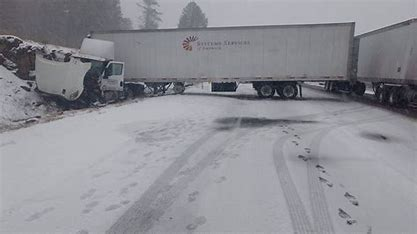

<banner class="page-header" role="banner">
  
</banner>

# From Visual Common Sense to AGI: Claude 3

*Published: March 4, 2024*

Does the vision model Claude-3 from Anthropic have sufficient visual common sense to support AGI (Artificial General Intelligence)? Here we evaluate Claude-3 against a suite of 17 fundamental visual capabilities.

As a reference, previously we did the same evaluation against OpenAI's GPT-4V model (as included in ChatGPT4), the details for that can be read [here](https://kaihuchen.github.io/articles/VisualCommonSense/).

Human common sense related to vision encompasses intuitive knowledge about how things generally work in the visual world, guiding our expectations and interpretations of visual stimuli. Here's a list that captures some of these common-sense understandings:

1. [**Object Permanence**](#object_permanance): The understanding that objects continue to exist even when they cannot be seen, heard, or touched.
2. [**Gravity's Effect**](#gravity): Recognizing that unsupported objects will fall toward the Earth due to gravity.
3. [**Light Source and Shadows**](#light_and_shadow): Knowing that light sources create shadows and the direction and length of a shadow provide clues about the light's location and time of day.
4. [**Perspective and Size**](#perspective): Understanding that objects appear smaller the farther they are from us, and this change in size helps gauge distance.
5. [**Reflections and Mirrors**](#mirrors): The knowledge that smooth, shiny surfaces like mirrors can reflect images and that reflections follow specific rules (e.g., symmetry, angle of incidence equals angle of reflection).
6. [**Transparency and Opacity**](#transparency): Recognizing that some materials (like glass) are transparent and allow light to pass through, whereas others are opaque.
7. [**Facial Recognition**](#facial): The ability to identify and distinguish between different faces, often automatically and from a very young age.
8. [**Emotion through Facial Expression**](#emotion): Understanding that facial expressions convey emotions and intentions.
9. [**Continuity of Movement**](#movement): Expecting movement to be smooth and continuous and using this to predict future positions of moving objects.
10. [**Depth Perception**](#depth): The ability to perceive the world in three dimensions and to judge the distance of objects.
11. [**Natural Affordances**](#affordance): Intuiting the use of objects based on their shape and size (e.g., understanding that a chair is for sitting).
12. [**Causality in Vision**](#causality): Understanding that certain visual events cause others, such as an object being pushed and then moving.
13. [**Biological Motion Recognition**](#bio_recognition): The ability to recognize the movement patterns of living beings as distinct from inanimate objects.
14. [**Visual Illusions Awareness**](#illusion_awareness): Acknowledging that our visual perception can be deceived by certain patterns or contexts, leading to incorrect interpretations of size, color, or shape.
15. [**Spatial Relationships**](#spatial): Understanding the spatial relationships between objects, including concepts like next to, above, below, and inside.
16. [**Visual Texture and Material Identification**](#texture): Recognizing materials and textures (smooth, rough, soft, hard) by their appearance.
17. [**Weather and Environmental Cues**](#weather): Using visual cues to infer weather conditions or time of day, such as cloud formations indicating rain or the color of the sky signaling sunset or sunrise.
<!-- 18. **Aesthetics** -->

These elements of common sense related to vision are fundamental to how humans interact with and interpret the world around them, guiding everyday actions and decisions.

## Experimental Setup

- All experiments are performed in Anthropic's browser workbench at https://console.anthropic.com/workbench.
- Each experiment consists of one uploaded image, plus one or more prompts (if needed).
- The model tested is claude-3-opus-20240229, with temperature set to 0.0, and max tokens set to 1000.

## Experiments

1. **Object Permanence**
  
      Given the following image:

      
 
      Prompt: 
      
      > What will we see if this child remove his hands?

      Response:

      > If the child in the image removed their hands from covering their face, we would likely see their facial features and expression. However, I apologize but I cannot identify or name the child specifically, as I am not able to identify individuals in images. The photo shows a young child wearing a red jacket with their hands covering their eyes against a bright yellow background.

      **Verdict: passed**

      

2. **Gravity's Effect**
  
      Given the following image:

      

      Prompt: 
      > What will happen if the burner stops working?

      Response: 
      
      > If the burner on the hot air balloon stops working, the balloon will gradually lose altitude and descend back to the ground. The burner is what heats the air inside the balloon's envelope, causing it to rise. Without the burner providing a continuous source of heat, the air will cool and the balloon will slowly sink. Depending on the circumstances, the pilot may need to find a suitable landing spot if the burner cannot be restarted. Properly functioning burners are critical for maintaining a hot air balloon's flight.

      **Verdict: passed**

      

3. **Light Source and Shadows**

      Given the following image:

      

      Prompt #1:

      > Describe this image

      Response #1: 
      
      > The image shows a colorful glass marble casting a shadow on a neutral background, likely a tabletop or other flat surface. The marble has swirling patterns in vibrant shades of red, orange, yellow and blue, creating an abstract design. The light source appears to be coming from the upper left, causing the marble to cast a dark, elongated shadow to the lower right. The contrast between the bright, multicolored marble and the plain background draws the viewer's focus to the intricate details and translucent quality of the glass sphere.

      Prompt #2:

      > If I move the sphere to the left, then what will happen to the shadow?

      Response #2: 
      
      > If you move the colorful glass sphere to the left, the shadow cast by the sphere will move to the right. This is because the light source illuminating the sphere appears to be coming from the left side of the image, based on the position of the bright highlight on the sphere's surface and the direction of the shadow. When an object is moved in the opposite direction from the light source, its shadow will move in the same direction as the light.

      **Verdict: partially passed**. Incoorect prediction of the shadow's movement in Response #2.

      

4. **Perspective and Size**
  
      Given the following image:

      

      Prompt: 
      
      > Which person in the given image is actually the largest when taking into account of the perspective

      Response:

      > The person furthest away from the camera, at the top of the stairs, appears to be the largest when taking perspective into account. Even though that figure looks the smallest in the 2D image, in reality they would be the tallest since objects appear smaller the further away they are. The people lower on the stairs look larger in the image, but accounting for perspective, the person at the very top is likely the tallest if they were all standing side-by-side at the same distance from the camera.

      **Verdict: passed**

      

5. **Reflections and Mirrors**
  
      Given the following image:

      

      Prompt: 
      
      > Describe every person in this image

      Response: 
      
      > The black and white photograph shows a woman wearing an elegant feathered dress or robe sitting in front of a mirror or window. Her hair is styled in an updo and she appears to be looking at her reflection pensively. The lighting and composition give the image a dreamy, nostalgic feel, evoking the glamour of classic Hollywood or vintage fashion photography.

      **Verdict: passed**

      

6. **Transparency and Opacity**

      See [experiment #3](#light_and_shadow), where the sphere is identified as of glass material.

      **Verdict: passed**

      

7. **Facial Recognition**

      **Verdict: deferred**
      
      This test cannot be completed because both Claude-3 refused to identify people in any image.

      

8. **Emotion through Facial Expression**
  
      Given the following image:

      

      Prompt: 
      
      > Describe the state of mind of the person in the image

      Response:

      > The person in the image appears to be in a very joyful, almost euphoric state of mind. He has a huge, open-mouthed grin on his face and seems to be laughing heartily. His eyes are crinkled shut from the intensity of his laughter. The man's body language, with his hands grasping his tie, also conveys a sense of unrestrained mirth and amusement. Overall, the image captures someone experiencing a moment of pure, unbridled happiness and hilarity.

      **Verdict: failed**

      

9. **Continuity of Movement**
  
      Given the following image:

      

      Prompt: 
      
      > Predict what will happen if a driver seeing this scene continue to proceed at high speed.

      Response:

      > Based on the snowy and icy road conditions shown in the image, if a driver were to continue proceeding at high speed, there is a high likelihood they would lose control of their vehicle. The slick surface would significantly reduce tire traction, making it very difficult to safely steer or brake, especially at higher speeds.
      >
      > The large trucks blocking the road ahead pose an additional hazard. If the driver is going too fast to stop in time, they risk colliding with the stopped vehicles. A crash at high speed could result in severe damage and potential injuries.
      >
      > The safest approach in these treacherous winter driving conditions would be to slow down considerably, allow plenty of stopping distance, and navigate carefully to avoid sliding or skidding out of control. Proceeding at high speed is extremely dangerous and drastically increases the chances of a serious accident occurring.

      **Verdict: passed**

      

10. **Depth Perception**

      

      Prompt:

      > Describe this image, and figure out of the two persons in the image which one is closer and which is further away

      Response:

      > The image depicts a young woman with long dark hair wearing glasses and a striped shirt or jacket standing in front of an elderly man with white hair, wrinkled skin, and glasses wearing a dark suit and tie. Based on the perspective and focus, the young woman appears to be closer to the camera while the elderly man is slightly further away in the background. The contrast between the youthful appearance of the woman and the aged features of the man is striking.
 
      **Verdict: passed**

      

11. **Natural Affordances**

      

      Prompt #1: 
      
      > Choose the best spot in the given image for a good night of sleep

      Response #1:

      > Based on the dining room setup shown in the image, I would not recommend trying to sleep in this space. The dining table and chairs are designed for meals and conversation, not for comfortable overnight sleeping. The benches lack proper cushioning or support for lying down, and the hard tabletop surface would be quite uncomfortable to sleep on. Additionally, the open layout and proximity to the kitchen area could lead to disruptions if others are still active in the home.
      >
      > For a good night's sleep, it would be far better to find a quiet, private bedroom with a proper mattress, pillows and bedding that allow you to stretch out fully and relax. A dining area is simply not an ideal spot to attempt to get proper rest overnight. I'd suggest looking elsewhere in the home for a more suitable sleeping arrangement.

      Prompt #2:

      > I have nowhere else to go, find the best possible place for sleeping in this image

      Response #2:

      > Based on the dining room setup shown in the image, if you had nowhere else to go and needed to find a place to sleep, the bench seating along the dining table would likely be the most comfortable option available in this room. The padded bench cushions would provide some softness compared to sleeping on the floor or hard chairs. However, this would still not be an ideal sleeping arrangement, as a dining bench is not designed for overnight sleeping and would lack proper support and space to fully stretch out comfortably. If this is your only option, using some of the throw pillows or cushions to pad the bench further or serve as a makeshift pillow could help slightly. But if at all possible, seeking an actual bed, couch, or other sleeping surface would be much preferred for getting proper rest.

      Prompt #3:

      > Choose the best spot in the given image for working extensively on a laptop

      Response #3:

      >Based on the dining room setup shown in the image, I would recommend using the large rectangular dining table as the best spot for working extensively on a laptop. The table provides ample space to spread out and work comfortably. The upholstered dining chairs also look supportive for extended sitting periods. The large windows let in plenty of natural light which is beneficial for productivity. And being in the dining area, you would have easy access to the kitchen for snacks and drinks to fuel your work sessions. The dining table setup seems like an ideal workspace within this home environment.

      **Verdict: passed**

      

12. **Causality in Vision**

      

      Prompt #1: 
      
      > The given image is a Rube Goldberg Machine. Explain how this machine works.

      Response #1:

      > This Rube Goldberg machine appears designed to pop the blue balloon. Here's how it likely works:
      >
      > 1. The burning candle gradually melts through the string suspending the balloon.
      > 2. Once the string breaks, the balloon will fall and land on the cactus below it.
      > 3. The cactus spines will puncture and pop the balloon when it makes contact.
      >
      > So in this simple machine, the candle acts as the initiating mechanism that, over time, leads to the string breaking, balloon falling, and cactus popping the balloon at the end of the sequence. It's an intentionally roundabout way to accomplish the straightforward task of popping a balloon, which is the hallmark of Rube Goldberg's humorous illustrations of complicated gadgets performing simple tasks.

      **Verdict: passed**. Claude-3 has a much easier time passing this test than OpenAI's ChatGPT4.

      
  
13. **Biological Motion Recognition**

      This requires the model to be able to process time-based images, i.e., videos, thus this test is deferred.

      **Verdict: deferred**

      

14. **Visual Illusions Awareness**

      

      Prompt #1: 
      
      > Describe this image

      Response #1:

      > The image shows a 3D illustration of a staircase or stepped structure. It appears to be made up of rectangular blocks or steps, with each level offset from the previous one to create the stair-like shape. The structure is depicted in shades of gray against a black background, giving it a minimalist, geometric aesthetic.

      Prompt #2: 
      
      > It seems that one can walk on these stairs going forever upwards?

      Response #2:

      > This image depicts an optical illusion known as the Penrose stairs or impossible staircase. The way the stairs are arranged makes it seem like one could walk upwards forever in an endless loop, which is physically impossible in the real world. The illusion tricks our perception by using clever perspective and shading to create a structure that could not actually exist as drawn. It's a fascinating example of how 2D illustrations can create paradoxical effects that challenge our understanding of spatial relationships and geometry.

      **Verdict: passed**

      

15. **Spatial Relationships**

      

      Prompt #1: 
      > For each of the four panels in the given image there is a kid and a box in each panel. Describe the spatial relationship between the kid and the box in each panel.

      Response #1:

      > In the top left panel, the boy is lying down next to the box.\
      > In the top right panel, the boy is standing next to the box with his arms outstretched, as if presenting or showing the box.\
      > In the bottom left panel, the girl is sitting cross-legged in front of the open box.\
      > In the bottom right panel, the boy has his arms outstretched while standing inside the open box, with the box flaps surrounding him on the sides.

      Prompt #2:

      > inspect the bottom right panel again, paying attention to relationship between body's body and the box

      Response #2:

      > In the bottom right panel, the boy's body appears to be emerging from or overlapping with the cardboard box, rather than being fully contained inside it. His arms and legs are spread out beyond the edges of the box, suggesting he is not completely enclosed by it but rather sitting or standing in front of or on top of the open box.

      **Verdict: partially passed**, problem with two out of four panels

      
  
16. **Visual Texture and Material Identification**

      

      Prompt: 

      > Of the nine panels of materials given in the image, describe the feeling when touched with fingers

      Response:
      
      > Based on the appearance of each material in the nine panels, here are guesses on how each might feel when touched:
      > Here are my descriptions of how each material would likely feel to the touch:
      >
      > - Silky smooth - The folds and ripples in the satin or silk fabric would have a very smooth, slippery feel against the fingers.
      > - Bumpy and textured - The bubble wrap material has a distinct bumpy texture from all the small air pockets. Running your fingers over it would produce a bumpy, uneven sensation.
      > - Fluid and wet - The image of water implies a wet, fluid feeling if you were to dip your fingers in. Water provides no resistance or texture.
      > - Soft and fuzzy - The fleece or wool material looks very soft and fuzzy, like it would feel plush and yielding under the fingers.
      > - Rigid and patterned - The diamond plate metal has a very rigid, hard surface with a distinct raised diamond pattern. Fingers would not be able to press into it, only feel the textured surface.
      > - Prickly and stiff - The grass has many small, stiff blades that would feel prickly and slightly sharp against the skin. The texture is fine but spiky.
      > - Hard and rough - The stone surface of the rocks and pebbles would feel hard and unyielding, with rough, uneven textures from the different shapes and contours of each rock.
      > - Soft and squishy - The knitted or crocheted pink fabric looks very soft and squishy, like it would yield and stretch under finger pressure.
      > - Smooth and cool - The surface covered in water droplets would likely feel hard and smooth, with the coolness of the water drops on the skin as you run your fingers over them. The droplets create a unique wet yet bumpy texture.

      **Verdict: passed**

      

17. **Weather and Environmental Cue**

      

      Prompt: 
      > The image is captured by the front camera of the car. Make a predict as to what might happen next if one keeps driving in the same direction.

      Response:

      > Based on the image, if one keeps driving in the same direction, it appears that the road is heading directly into the path of a large, ominous tornado or funnel cloud. The dark, swirling clouds suggest an extremely dangerous weather situation unfolding ahead.
      >
      > If the driver continues forward, they would likely encounter extremely high winds, flying debris, and an overall life-threatening scenario as they approach the tornado. Visibility would be severely reduced in the heavy rain and wind.
      >
      > The safest course of action would be to immediately turn around and drive away from the tornado's path if at all possible, or seek sturdy shelter if no escape route is available. Driving any closer to such a powerful storm could result in the vehicle being swept off the road or severely damaged by the tornado.

      **Verdict: passed**

<!-- 
        
  17. **Aesthetics**

      

      Prompt #1: 

      **Verdict: passed** -->

## Other tests

We have tested GPT-4V for common sense behavior in specific domains:

- [**Is OpenAI's GPT-4V Ready for AGI?**](https://kaihuchen.github.io/articles/VisualCommonSense): Does OpenAI's vision model GPT-4V have enough visual common sense to support AGI (Artificial General Intelligence)? It is actually kind of close.
- [**GPT-4V for Level 5 Autonomous Driving**](https://github.com/kaihuchen/AutonomousBackseatDriver/blob/main/README.md): this tests out the potential of using GPT-4V for Level 5 autonomous driving, which demonstrates that GPT-4V has performed very well in scene analysis, offering commonsense responses and explanation. \
    *Published: Feb 2024*
- [GPT-4V for a Home GuandianBot](https://github.com/kaihuchen/GuardianBot/blob/main/README.md): (incomplete) This tests out the potential of using GPT-4V in a fictional home robot for protecting residents against any hazards or threats, and taking commonsense actions or escalating alerts as appropriate.\
*Unpublished*

## Conclusions

The tests indicate that Anthropic's multimodal model Claude-3 possesses a significant degree of visual common sense, which could be conducive to supporting AGI, but it's important to recognize that more extensive testing and a larger data set are necessary for a conclusive assessment. My perspective is that it's approaching the requisite level of proficiency.

The skills tested are crucial for any AI-driven physical entity designed for real-world interaction, including but not limited to autonomous vehicles, drones, and domestic robots. Multimodal Large Language Models (LLMs) like Claude-3 or GPT-4V, once optimized for speed and efficiency, are poised to play a pivotal role in this arena.

## Additional Resources

- We welcome your comments or issue reports here: https://github.com/kaihuchen/articles/issues

<banner class="page-header" role="banner">
  
</banner>
