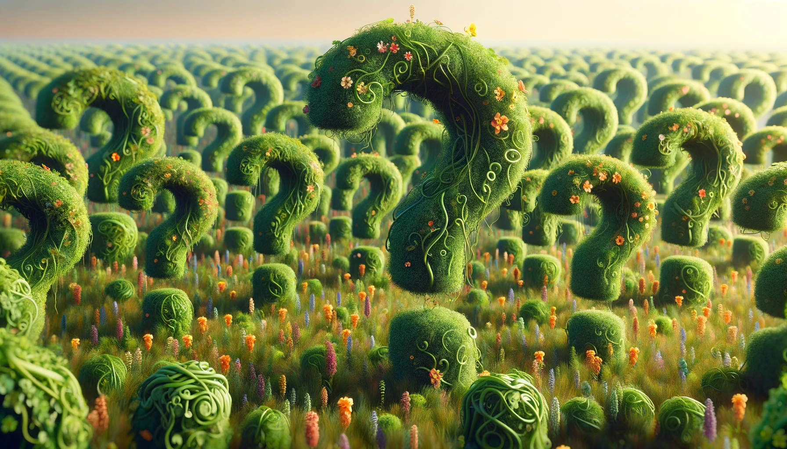

<banner class="page-header" role="banner">
  
</banner>

# Why develop *Ensemble GenAI*?

*UNFINISHED DRAFT*

## What is *Ensemble GenAI*

*Ensemble GenAI* is a software architecture that combines many generative AI chatbots to provide better functionality than a single chatbot could offer.

For the purpose of this discussion, we will focus on *Ensemble GenAI* with the following characteristics:

- *Heteroneous* chatbots which are built with different desgins, etc. 
- *Distributed* chatbots that scatter about in different geographic locations, hosted on different servers, owned by diffferent organizations, etc.
- *Diverse* chatbots which are trained with different data, specialized for various domains, etc.
- *Collaborative* chatbots.

Are there any existing *Ensemble GenAI* systems? Well, sort of. OpenAI's plugins can be said to be a kind of *Ensemble GenAI* system, but while it offers an assortment of diverse chatbots, it is not heterougeous, not distributed, nor collaborative.

## Benefits

Why do we want to go into the trouble of developing the type of *Ensemble GenAI* as mentioned above? There are certain types of problems that could benefit from such an architecture:

- 

<!-- <banner class="page-header" role="banner">
  
</banner> -->
