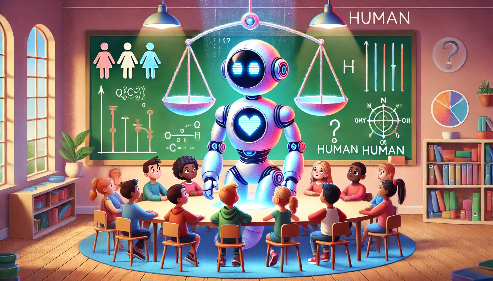

<banner class="page-header" role="banner">
  
</banner>

# Why AI Should Not Be Granted Welfare or Rights

*Published: 2024.11.17*

The debate over AI welfare (see: [Taking AI Welfare Seriously](https://eleosai.org/post/taking-ai-welfare-seriously/)) proposes that we should consider "welfare and moral patienthood" for advanced AI systems exhibiting signs of consciousness and/or robust agency. While well-intentioned, this perspective overlooks fundamental differences between AI and humans and could introduce chaos into our society. Here are some key arguments:

Firstly, AI "consciousness" is unverifiable, highly controversial, and fundamentally different from human consciousness, which is rooted in biological and emotional experiences. Granting rights based on a contentious and ill-defined concept risks undermining the foundations of rights designed for beings with genuine self-awareness.

Secondly, current AI systems can be easily altered, replicated, started, stopped, deleted, and restored, fundamentally distinguishing them from humans and animals. It is absurd to take AI's digital "suffering" seriously, especially when researchers are intentionally designing AI to appear convincingly real, misleading us into attributing human-like experiences to them.

Moreover, anthropomorphizing AI diverts attention from pressing human and animal welfare issues, misplacing ethical priorities. Focusing on AI welfare could detract resources from critical human needs. 

Most people agree on the importance of clearly marking AI-generated text, images, videos, and audio to differentiate them from the "real thing." Why, then, would we want to blur the more important line between human welfare and AI's?

Our focus should remain on responsible AI development, ensuring these tools benefit humanity without causing harm. While the AI welfare concept arises from ethical concern, the fundamental differences between AI and humans underscore why AI should not be afforded human-equivalent welfare or rights. The urgent issue here should not be about how to solve problems arise from blurring the line, but how to define the line clearly in order to avoid future dilemmas.

*Disclaimer*: I am far from an AI naysayer. I have studied and researched AI for four decades, holding multiple degrees and patents in the field.

<!-- <banner class="page-header" role="banner">
  
</banner> -->
