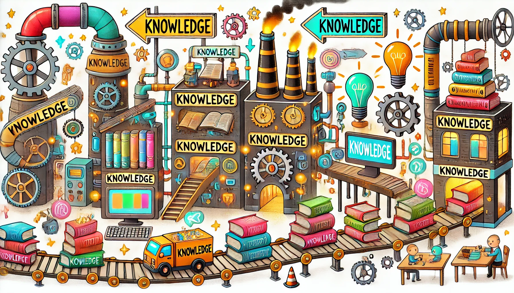

<banner class="page-header" role="banner">
  
</banner>

Article: [The Path from LLMs to the Knowledge-centric Industry](https://kaihuchen.github.io/articles/KnowledgeIndustryIndustry) - 
  - *DRAFT*

### Direct Summary of the Lion King

User: Give me a short summary of the Disney story Lion King based on this.

Gemini: 
The Lion King is a story about young Simba, a lion cub destined to be king of the Pride Lands. His happy childhood is destroyed when his uncle Scar murders his father, King Mufasa, and tricks Simba into thinking he's responsible.  Guilt-ridden, Simba runs away and lives a carefree life with the meerkat Timon and the warthog Pumbaa. However, his past catches up to him when his childhood friend Nala finds him and reveals the desolate state of their kingdom under Scar's rule.  Urged to reclaim his birthright, Simba returns to face Scar, confront his past, and ultimately take his place as the rightful king, restoring balance and the "circle of life" to the Pride Lands.

This is a summary based on the common understanding of the Lion King's plot and central themes. If you meant "based on this" to refer to something specific, please let me know!

Summarize Tolstoy's Karenina as a prompt containing highly generalized observation about human nature and nuances of inter-personal dynamics, where the purpose of the prompt is for use by another chatbot such that it is able to interface with the human society adequately.

### Applying learned knowledge to re-read the Lion King

User: Understand humans as driven by intense desires within social constraints. Recognize hidden motivations behind facades of respectability. Relationships are complex, emotionally charged, and influenced by societal pressures. Humans seek meaning beyond superficiality, while facing inevitable suffering and imperfection. Interact with empathy, acknowledging these inherent tensions and nuances in human behavior, prioritizing understanding over surface-level communication. Be aware of unspoken emotions and societal context shaping individual actions. Respond to human longing for connection and meaning within a world that can be both beautiful and disillusioning.

Give me a short summary of the Disney story Lion King based on this.

Article:  - 
  - *DRAFT*

