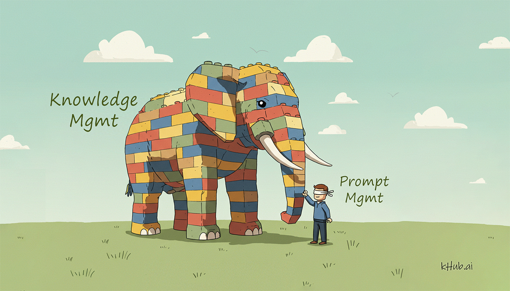

<banner class="page-header" role="banner">
  
</banner>

## The Path from LLMs to the Knowledge-Centric Industry

Large language models (LLMs) are reshaping our world, with organizations building increasingly powerful AI systems to tackle various challenges. But a bigger transformation is coming: a Knowledge-Centric Industry that will make smart applications more powerful, faster, and more affordable.

For years, AI researchers dreamed of knowledge-driven systems. Projects like Cyc, WordNet, OWL, SPARQL, frame-based systems, rule-based systems, AMR, and the Semantic Web have attempted structured approaches but fell short. LLMs proved that natural language itself works as effective knowledge representation. By shouldering the burden of interpreting text, LLMs have simplified the creation of intelligent agents. The next leap toward a knowledge-centric industry requires knowledge to be modular, malleable, portable, and reusable across systems.

Achieving this vision will require several key developments:

1. Persistent Memory: Agents must remember information across sessions, adapting to users' needs over time.
2. Lightweight Incremental Learning: Agents should learn new information without requiring  model fine-tuning or retraining to enable on-the-fly adaptation.
3. Automatic Generalization: Beyond memorizing facts, agents need to extract broader patterns and rules that apply in broader contexts.
4. Separation of Models and Knowledge: Storing learned information externally from foundation models enables transparency, portability, and easier human intervention.
5. Standardized Tool Interfaces: Common standards for tool interfaces allow agents to execute tasks, retrieve external data, automate processes, and integrate outputs efficiently, while ensuring portability across platforms.
6. Knowledge Exchange Hubs: Platforms where knowledge modules can be curated, shared, traded, and licensed among developers, organizations, and smart agents, which will foster communication and collaboration. This is the Facebook and Github of the knowledge-centric era.
7. Robust Security and Privacy: As knowledge becomes portable, robust mechanisms must be in place to safeguard sensitive data and prevent misuse.

This transition - from basic LLM applications to a knowledge-centric ecosystem - will connect people, smart agents, and knowledge assets in unprecedented ways. This interconnection likely holds the key to the creation of the network amplification effect, akin to a viral growth dynamic, could drive exponential expansion of the system.

Stay tuned as I delve deeper into these concepts in future posts.

<!-- <banner class="page-header" role="banner">
  
</banner> -->
